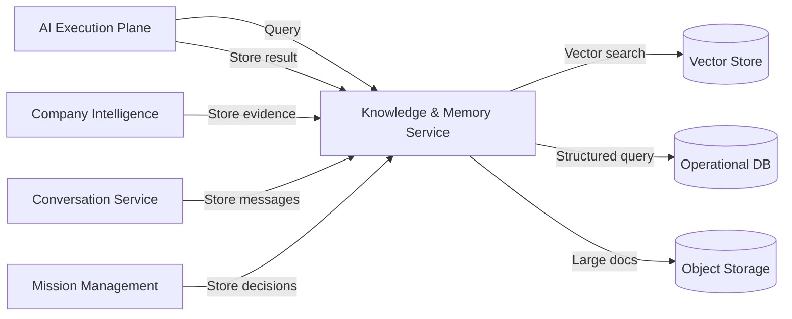

# Knowledge and Memory Architecture

## Purpose

AI agents need access to facts, learned patterns, conversation history, mission context, and domain knowledge. The Knowledge and Memory architecture provides retrieval services while maintaining tenant isolation, versioning, and retention.

## Memory Types

| Type | Description | Owner | Storage |
|---|---|---|---|
| Semantic Memory | Long-term facts about companies, markets, ICPs | Knowledge & Memory Service | Vector store |
| Episodic Memory | Past agent executions and outcomes | Knowledge & Memory Service | Operational DB + Vector store |
| Conversation Memory | Recent messages in a conversation | Conversation Service / Memory Service | Operational DB |
| Mission Memory | Context and decisions within a mission | Mission Management / Memory Service | Operational DB |
| Agent Memory | Agent-specific learned patterns | Knowledge & Memory Service | Vector store |
| Tenant Knowledge | Tenant-specific templates, policies, examples | Knowledge & Memory Service | Vector store + Object storage |
| System Knowledge | Platform-wide patterns and guardrails | Knowledge & Memory Service | Object storage |
| External Research | Normalized research data | Company Intelligence | Operational DB |

## Knowledge Items

A knowledge item is a stored piece of information with:

- TenantId (or global for system knowledge)
- Source (agent, human, external, system)
- Content
- Embedding vector (for semantic retrieval)
- Tags/categories
- Confidence
- Validity period
- Version

## Retrieval Patterns

| Pattern | Use Case |
|---|---|
| Vector similarity | Find similar companies, past conversations, relevant templates |
| Keyword/filtered search | Find specific knowledge by tag or metadata |
| Hybrid search | Combine vector and keyword results |
| Context injection | Retrieve top-N items and inject into prompt |
| Memory summarization | Summarize long conversation/mission history |

## Architecture

## Isolation

- Each knowledge item is tagged with tenant ID.
- Vector collections are tenant-scoped or filtered by tenant ID.
- Global system knowledge is read-only and tenant-agnostic.
- No cross-tenant retrieval by default.

## Versioning

- Knowledge items can be versioned.
- Old versions retained for audit and reproducibility.
- Retractions create new versions marked invalid.

## Retention

- Conversation memory retained per tenant policy.
- Mission memory retained per tenant policy.
- Knowledge items can be expired or refreshed.
- Audit logs retained per compliance policy.

## Memory Safety

- Retrieved context is sanitized before inclusion in prompts.
- Knowledge cannot override policy or security.
- Poisoning detection: monitor for anomalous knowledge changes.
- Human feedback loop to correct or remove bad knowledge.

## Performance

- Cache frequently accessed knowledge in tenant-scoped cache.
- Pre-compute embeddings for stable knowledge.
- Use approximate nearest neighbor search.
- Limit context window size per prompt.
