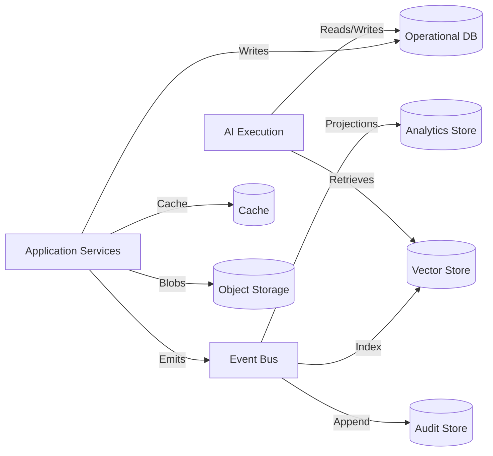

# Data Architecture

## Data Categories

| Category | Purpose | Consistency | Access Patterns |
|---|---|---|---|
| Operational | Transactional domain data | Strong | CRUD, queries per tenant |
| Event | Domain and integration events | Append-only | Replay, projections |
| Knowledge | Semantic knowledge and embeddings | Eventual | Vector search, retrieval |
| Memory | Conversation, mission, agent memory | Eventual | Retrieval, summarization |
| Analytics | Aggregated reports and KPIs | Eventual | Read-heavy dashboards |
| Audit | Immutable decision/action logs | Append-only | Compliance queries |
| Cache | Hot data and session state | Eventual | Fast reads |
| Object Storage | Files, exports, large messages | Strong | Blob access |
| Vector Search | Semantic retrieval | Eventual | Similarity search |

## Logical Data Ownership

| Data | Owner | Storage Category |
|---|---|---|
| Tenant configuration | Tenant Management | Operational |
| Users, roles, memberships | User Management | Operational |
| Missions, plans, outcomes | Mission Management | Operational |
| ICP profiles, rules | ICP & Intelligence | Operational |
| Companies, contacts, research | ICP & Intelligence | Operational + Vector |
| Leads, qualifications | Lead Management | Operational |
| Opportunities | Opportunity Management | Operational |
| Conversations, messages | Conversation/Outreach | Operational + Object |
| Meetings | Meeting Service | Operational |
| Agents, executions | AI Agent Management | Operational + Event |
| Policies, approvals | AI Governance | Operational |
| Knowledge items | Knowledge & Memory | Vector + Object |
| Audit records | Audit Service | Audit Store |
| Usage records | Billing | Operational + Analytics |
| Reports | Revenue Analytics | Analytics Store |

## Data Flow

## Consistency Model

- Operational data: strong consistency within an aggregate.
- Cross-aggregate: eventual consistency via events.
- Analytics: eventual consistency via projections.
- Knowledge: eventual consistency after embedding.
- Audit: append-only, immutable.

## Data Isolation

- Tenant ID is part of every tenant-scoped record.
- Database schemas or row-level security enforce tenant isolation.
- Cache keys include tenant ID.
- Object storage paths include tenant ID.
- Analytics projections are tenant-scoped.
- Vector collections are tenant-scoped or filtered.

## Data Retention

- Operational data: per tenant policy, typically 1-7 years.
- Events: retained for replay and audit; per tenant policy.
- Audit: retained per compliance policy; immutable.
- Analytics: aggregated; raw events may be purged.
- Knowledge: refreshed or expired per policy.
- Cache: short TTL.
- Object storage: per tenant policy.

## Backup and Recovery

- Operational DB: point-in-time backups.
- Event log: durable retention for replay.
- Audit: write-once, replicated.
- Analytics: rebuilt from events if needed.
- Object storage: versioning and replication.

## Scaling Considerations

- Operational DB: shard by tenant if needed.
- Event bus: partitioned by aggregate or tenant.
- Vector store: tenant-scoped indexes or collections.
- Analytics: columnar store for aggregations.
- Cache: horizontally scalable.
- Object storage: cloud-native scaling.
