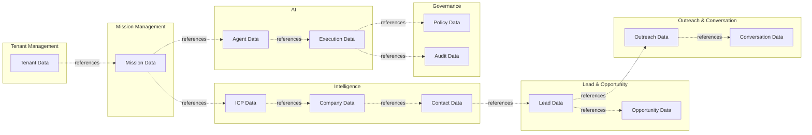

# Data Ownership

## Ownership Rules

Each bounded context owns its data. No service can write another context's data directly.

## Ownership Matrix

| Bounded Context | Data Owned |
|---|---|
| Tenant & Organization Management | Tenant, Organization, Workspace configuration |
| User & Identity Management | User, Role, Permission, TenantMembership |
| Revenue Mission Management | Mission, MissionPlan, MissionObjective, Outcome |
| ICP & Market Strategy | ICPProfile, ICPFilter, ICPSignal, ICPMatch |
| Company Intelligence | Company, CompanyResearch, Evidence, ExternalReference |
| Contact Intelligence | Contact, DecisionMakerProfile, ContactEnrichment |
| Lead & Qualification Management | Lead, Qualification, DisqualificationReason |
| Buying Signal Intelligence | BuyingSignal, SignalSource, SignalEvaluation |
| Opportunity Management | Opportunity, OpportunityStage, OpportunityScore |
| Outreach & Communication | OutreachCampaign, Message, Template |
| Conversation Management | Conversation, ConversationState, Message thread |
| Meeting & Scheduling | Meeting, MeetingSlot, AvailabilityWindow |
| CRM Synchronization | CRMConnection, SyncMapping, CRMRecordReference |
| AI Agent Management | Agent, AgentVersion, AgentCapability, AgentExecution, AgentTask, AgentOutcome, AgentFailure |
| Knowledge Management | KnowledgeItem, KnowledgeSource, Memory |
| AI Governance & Policy | Policy, AutonomyPolicy, ApprovalRule, Approval |
| Billing & Subscription | Subscription, UsageRecord, CreditBalance |
| Compliance & Consent | Consent, SuppressionRecord, PrivacyRule |
| Audit & Governance | AuditRecord, DecisionLogEntry |
| Revenue Analytics | Read-only projections, reports, KPIs |

## Shared Data Patterns

### Reference by Identity

Services reference data owned by other services using identity value objects, not foreign keys enforced by another service.

### Read Models

Services can maintain local read models of other contexts' data by consuming events. The read model is eventually consistent and not authoritative.

### Duplication with Ownership

Some data may be duplicated for performance (e.g., tenant name in audit records), but the owning service remains the source of truth.

## Data Access Rules

| Access Type | Allowed |
|---|---|
| Own aggregate writes | Yes |
| Own aggregate reads | Yes |
| Direct writes to other service aggregates | No |
| Event consumption | Yes |
| Read model query | Yes, eventually consistent |
| Synchronous query via API | Yes, for authorization/read |

## Cross-Tenant Data Rules

- A service must never return data from another tenant in response to a tenant-scoped query.
- Background workers process one tenant context at a time or enforce tenant filters.
- Analytics aggregates must be tenant-scoped.
- Cache keys must include tenant ID.

## Data Ownership and Extraction

If a context is extracted into a separate service, its data ownership moves with it. Other services continue to reference it by identity and events.

## Data Ownership Diagram

