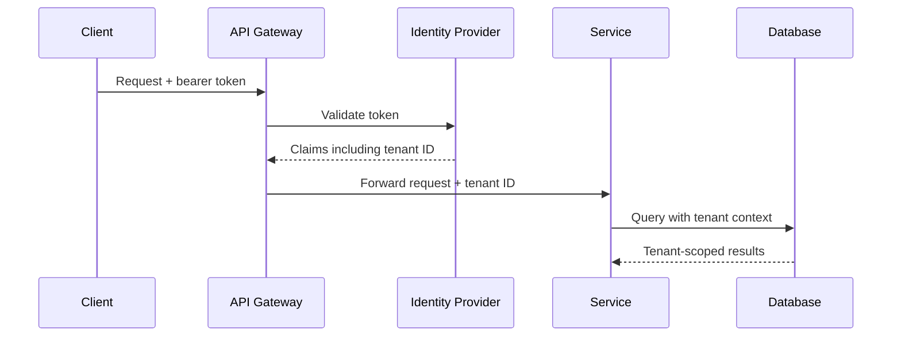

# Multi-Tenancy Architecture

## Tenant Isolation Model

The platform uses a **shared infrastructure with strong logical tenant isolation**. Runtime and data layers enforce isolation so that cross-tenant access is impossible by default.

## Isolation Layers

| Layer | Isolation Mechanism |
|---|---|
| API / Gateway | Tenant ID from authenticated token; routing and rate limits per tenant |
| Identity | Tenant-scoped roles and permissions in claims |
| Application Services | Tenant context propagated to all operations |
| Domain Layer | Tenant ID is part of aggregate identity and invariants |
| Database | Per-tenant schemas or row-level security (RLS) |
| Event Bus | Tenant ID in every message; consumer filtering |
| Workers | Tenant context in job metadata; no cross-tenant batching |
| AI Execution | Prompt context and memory scoped to tenant |
| Knowledge / Vector | Tenant-scoped collections or filters |
| Cache | Tenant ID in cache keys |
| Object Storage | Tenant ID in paths |
| Audit | Tenant ID in every record |
| Analytics | Tenant ID in every projection |
| Integrations | Tenant-scoped credentials and connections |

## Tenant Identity Propagation

## Database Isolation

- PostgreSQL with per-tenant schemas and row-level security (RLS) as per ADR-054.
- Query builders and ORM enforce tenant filters.
- Migrations applied per schema.
- Connection pooling keyed by tenant where beneficial.

## Event Bus Isolation

- Every event and command includes TenantId.
- Consumers filter or route by TenantId.
- Multi-tenant topics may be partitioned by tenant hash for throughput.
- No consumer processes events from multiple tenants in a single unsafe context.

## Worker Isolation

- Background jobs carry tenant context.
- Workers do not mix tenant data in memory.
- Long-running workflows scope state by tenant.

## AI Isolation

- Prompt context assembled only from tenant-allowed data.
- LLM provider calls do not leak tenant context between requests.
- Agent memory retrieval filtered by tenant.
- Tool invocations enforce tenant scoping.

## Cache Isolation

- Cache keys: `tenant:{tenantId}:entity:{key}`.
- No shared cache entries across tenants.
- Cache invalidation is tenant-scoped.

## Object Storage Isolation

- Paths: `tenants/{tenantId}/...`.
- Signed URLs scoped to tenant and object.

## Analytics Isolation

- Aggregations always include tenant filter.
- Dashboards enforce tenant membership.

## Cross-Tenant Operations

- Platform administrators may have cross-tenant read views; writes are rare and audited.
- Cross-tenant analytics is anonymized and aggregated.
- Any cross-tenant access requires explicit authorization and audit.

## Tenant Suspension

- Suspended tenants cannot authenticate.
- In-flight operations are cancelled or paused.
- Events from suspended tenants are dropped or queued.
- Billing and data retention policies still apply.
