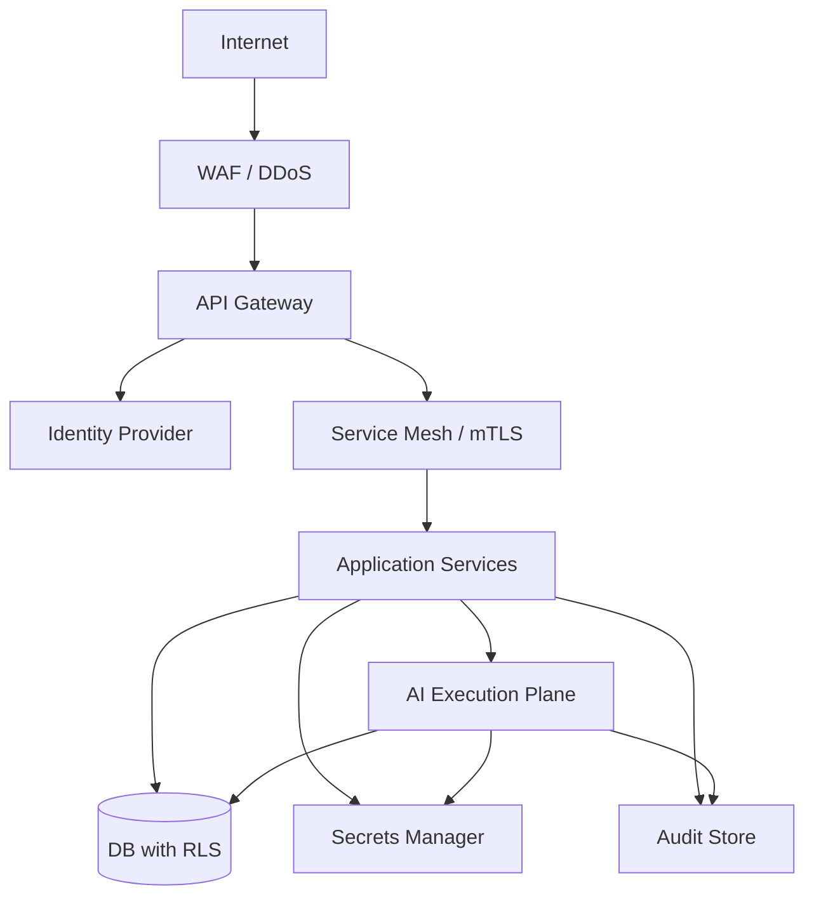

# Security Architecture

## Security Principles

- **Zero trust**: Every request is authenticated and authorized.
- **Least privilege**: Services and agents have the minimum required permissions.
- **Defense in depth**: Multiple security layers at network, application, and data levels.
- **Tenant isolation**: Cross-tenant access is impossible by default.
- **Audit everything**: Security-relevant events are logged immutably.

## Authentication

- External users authenticate via OIDC/OAuth2 identity provider.
- Service-to-service communication uses mTLS or signed tokens.
- Agents and workers authenticate via service identities.
- Short-lived access tokens; refresh tokens handled securely.

## Authorization

- **RBAC**: Roles define permission sets (e.g., Revenue Manager, Compliance Admin).
- **Tenant scoping**: Roles and permissions are scoped to a tenant.
- **ABAC where necessary**: Policy-based access for sensitive actions (e.g., high-value prospect data).
- **API Gateway enforcement**: Validates tokens, tenant membership, and rate limits.
- **Service-level enforcement**: Re-validates permissions and tenant context.
- **Database-level enforcement**: Row-level security enforces tenant isolation.

## Service Identity

- Each service and worker has an identity.
- Service-to-service calls carry identity and tenant context.
- Agent executions carry agent identity and tenant context.
- Tool invocations carry execution identity for audit.

## Secrets Management

- API keys, connection strings, and credentials stored in a secrets manager.
- Secrets rotated regularly.
- No secrets in code, container images, or configuration files.
- Runtime injection via environment or sidecar.

## Encryption

- **In transit**: TLS 1.3 for all external and internal communication.
- **At rest**: Database encryption, object storage encryption, cache encryption where supported.
- **Sensitive fields**: PII encrypted at application level where required.
- **Backup encryption**: All backups encrypted.

## Network Boundaries

- API Gateway is the only public-facing entry point.
- Internal services behind private network / service mesh.
- Databases and caches not exposed publicly.
- External integrations egress through a controlled gateway.

## Webhook Security

- Webhook endpoints require authentication.
- Signatures verified using shared secrets or public keys.
- Payloads validated and sanitized.
- Rate limiting applied.

## API Security

- Input validation at API Gateway and service layer.
- Output filtering to prevent data leakage.
- Rate limiting per tenant, per user, per IP.
- Idempotency keys for mutation endpoints.
- CORS restrictions.
- Security headers.

## Vulnerability Management

- Dependency scanning in CI/CD.
- Container image scanning.
- Static application security testing (SAST).
- Penetration testing schedule.
- Security patch process.

## Security Monitoring

- Centralized logging of authentication, authorization, and data access events.
- Alerts for suspicious patterns (e.g., cross-tenant access attempts, excessive API usage).
- Incident response runbooks.

## Security Boundaries Diagram

