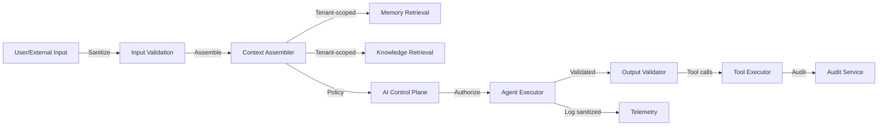

# AI Security Architecture

## Threats and Defenses

| Threat | Defense |
|---|---|
| Prompt injection | Input/output validation, system prompt hardening, allowlists for tool use, human approval for risky actions |
| Indirect prompt injection | Sanitize retrieved knowledge/memory; validate citations; do not trust external content |
| Tool poisoning | Tool registry with versioned, signed definitions; capability and policy checks; no dynamic tool loading from untrusted sources |
| Malicious web content | URL allowlists, content sanitization, sandboxed scraping, no execution of fetched content |
| Memory poisoning | Knowledge change auditing, anomaly detection, human feedback loop, tenant isolation |
| Credential leakage | Secrets manager, no credentials in prompts, LLM provider key rotation, output filtering |
| Cross-tenant leakage | Tenant-scoped context assembly, per-tenant vector collections, RLS, no shared prompts across tenants |
| Agent privilege escalation | Capability registry, policy engine, least privilege, no agent can self-elevate |
| Unauthorized actions | Control plane authorization for every tool call, approval workflows, audit |
| Model manipulation | Model registry with approved models, output validation, no user-provided system prompts |
| Context leakage | Strict prompt context boundaries, sanitization of retrieved memory, no cross-mission leakage |
| Autonomous action abuse | Autonomy levels, budgets, rate limits, human approvals, emergency stop |

## Prompt Security

- System prompts are controlled by the platform, not users.
- User/tenant-provided content is treated as untrusted and escaped/validated.
- Prompt templates are reviewed and versioned.
- Output is parsed and validated before acting on it.

## Tool Use Security

- Agents cannot invoke tools not in their capability registry.
- Tool inputs are validated against JSON schemas.
- High-risk tools require human approval.
- Tool outputs are validated before returning to agent.
- No tool can access another tenant's data.

## Knowledge and Memory Security

- Retrieved context is filtered by tenant and relevance.
- Knowledge item changes are audited.
- Anomaly detection flags unusual updates.
- Global system knowledge is read-only to agents.

## Model Provider Security

- Approved model providers only.
- API keys stored in secrets manager.
- Requests/responses logged without sensitive content.
- Data processing agreements reviewed for each provider.

## Human Overslap

- High-stakes actions always require human approval.
- Suspicious agent behavior triggers escalation.
- Compliance admin can suspend agents/missions/tenants.

## AI Security Testing

- Red teaming of prompts and tool use.
- Adversarial test cases for prompt injection.
- Evaluation of output validation.
- Regular review of agent capabilities and policies.

## AI Security Architecture Diagram

