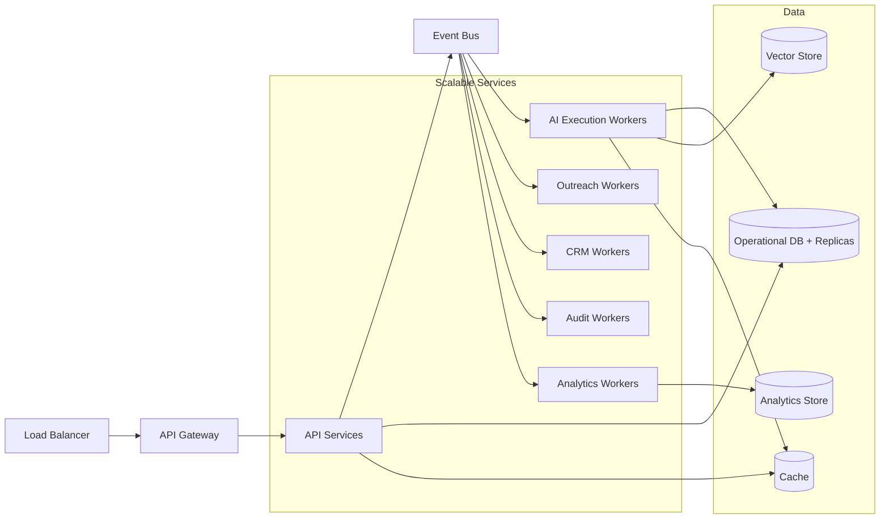

# Scalability Architecture

## Scaling Boundaries

| Workload | What Scales | Why |
|---|---|---|
| API traffic | API Gateway + application service instances | User-facing requests vary by tenant activity |
| Agent execution | AI Execution Worker pool | LLM calls, tool calls, and reasoning are CPU/network-heavy |
| LLM requests | LLM Gateway instances + worker pool | External provider throughput and latency vary |
| Research/web crawling | Research worker pool | External data gathering is bursty and slow |
| Email sending | Outreach worker pool | High volume, provider rate limits |
| Conversation handling | Conversation worker pool | Inbound/outbound message bursts |
| Meeting scheduling | Meeting worker pool | Calendar API interactions |
| CRM synchronization | CRM worker pool | Rate-limited external API calls |
| Event processing | Event consumers | Event volume grows with mission activity |
| Analytics projections | Analytics worker pool | Read-heavy, background projection |
| Knowledge retrieval | Knowledge & Memory service + vector store | Retrieval load grows with data |
| Audit ingestion | Audit worker pool | Append-only high volume |

## Horizontal Scaling Rules

- Stateless services can scale horizontally behind a load balancer.
- Stateful workflows and missions require durable persistence; workers scale horizontally but coordinate via database/lock.
- Workers pulling from queues scale based on queue depth and CPU.
- AI execution workers scale based on pending task count and LLM provider capacity.
- Event consumers scale per consumer group and topic partition.

## Scaling Triggers

| Metric | Scale Action |
|---|---|
| API p95 latency > threshold | Add API service instances |
| AI task queue depth > threshold | Add AI execution workers |
| LLM error rate > threshold | Circuit break and fallback |
| CRM sync queue depth > threshold | Add CRM workers (subject to rate limits) |
| Email queue depth > threshold | Add outreach workers |
| Vector search latency > threshold | Scale vector store nodes or replicas |
| Database CPU > threshold | Scale DB read replicas or shard |
| Cache hit rate < threshold | Scale cache cluster |

## Tenant-Induced Scaling

- Noisy-neighbor isolation through per-tenant rate limits and quotas.
- AI token budgets per tenant prevent runaway costs.
- Per-tenant worker pool caps where needed.
- Tenant data sharding for operational DB when single-tenant load is high.

## Data Scaling

- Operational DB: read replicas for read-heavy modules; sharding by tenant if needed.
- Vector store: partitioned or per-tenant collections; approximate nearest neighbor indexes.
- Analytics: columnar store with partitioning by time and tenant.
- Audit: time-series/append-only store with retention and archival.
- Object storage: cloud-native, no capacity limit.
- Cache: horizontally scalable with eviction policies.

## Cost Scaling

- Use cheaper models for low-risk tasks.
- Cache LLM results where appropriate.
- Batch research jobs.
- Prioritize high-intent prospects.
- Right-size AI worker pool to avoid idle GPUs/token capacity.

## Scalability Diagram

## Anti-Patterns

- Do not scale all services together if only one bottleneck exists.
- Do not share event partitions across tenants without filtering.
- Do not scale AI workers without token/cost budgets.
