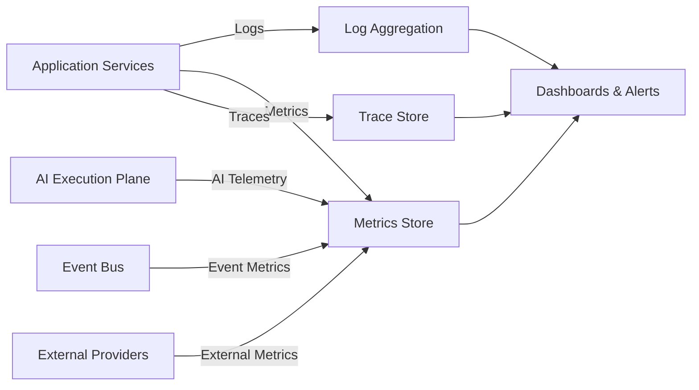

# Observability Architecture

## Observability Pillars

- **Logs**: structured, tenant-scoped, queryable.
- **Metrics**: counters, gauges, histograms per service/tenant/workload.
- **Traces**: distributed traces across services, AI execution, external calls.
- **AI telemetry**: token usage, model usage, latency, cost, output quality.
- **Mission telemetry**: end-to-end mission outcomes and bottlenecks.

## Correlation IDs

Every request, event, and AI execution carries:

- `correlationId`
- `tenantId`
- `userId` or `agentId`
- `missionId`
- `executionId`
- `taskId`
- `toolId`
- `eventId`

These IDs propagate across synchronous and asynchronous boundaries.

## Logging

- Structured JSON logs.
- Severity levels: DEBUG, INFO, WARN, ERROR, FATAL.
- Sensitive data redacted.
- Tenant context included.
- Centralized log aggregation.
- Retention aligned with compliance.

## Metrics

| Category | Examples |
|---|---|
| API | Request count, latency, error rate, rate-limit hits |
| AI | Token usage, cost, latency, fallback rate, model distribution |
| Events | Produced/consumed, lag, DLQ size, retry rate |
| Missions | Active, completed, failed, paused, awaiting approval |
| External | CRM sync lag, email delivery rate, meeting booking rate |
| Security | Auth failures, permission denials, suspicious activity |

## Tracing

- Distributed tracing spans across API Gateway → Services → Workers → External providers.
- AI execution spans include prompt, model, tool calls, and validation.
- Traces correlated with events and audit records.

## AI Telemetry

- Prompt and response token counts per model.
- Cost per tenant/mission/execution.
- Latency per model and provider.
- Output validation results.
- Human intervention triggers.
- Reflection/evaluation scores.

## Mission Telemetry

- Mission lifecycle state transitions.
- Step-level durations.
- Human approval wait times.
- External dependency failures.
- Outcome and conversion metrics.

## Alerting

| Condition | Severity | Response |
|---|---|---|
| API p99 latency > SLO | High | Scale or investigate |
| LLM provider error rate > threshold | High | Fallback, notify |
| DLQ non-empty | Medium | Investigate |
| Cross-tenant access attempt | Critical | Block, investigate |
| Mission failure rate > threshold | High | Investigate |
| AI cost budget exceeded | Medium | Throttle, notify |

## Dashboards

- Platform health dashboard
- Tenant health dashboard
- Mission execution dashboard
- AI execution dashboard
- Cost and usage dashboard
- Security events dashboard

## Observability Boundaries

- Logs do not contain secrets or raw external credentials.
- PII is redacted or tokenized.
- Tenant admins see only tenant-scoped telemetry.
- Platform admins see aggregate and per-tenant views.

## Observability Architecture Diagram

