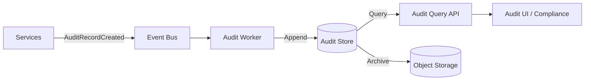

# Audit Architecture

## Audit Scope

The audit architecture records human actions, agent actions, agent decisions, tool executions, policy decisions, approvals, messages, CRM changes, configuration changes, security events, tenant events, and AI outputs where required.

## Audit Principles

- **Immutable**: Audit records are append-only.
- **Tamper-resistant**: Append-only storage, access controls, integrity checks.
- **Comprehensive**: Capture who/what/when/why/result for security-relevant actions.
- **Tenant-scoped**: Every audit record includes tenant context.
- **Queryable**: Support compliance, debugging, and forensic queries.

## What to Audit

| Action | Capture |
|---|---|
| Human login/logout | Identity, IP, result |
| Permission changes | Actor, target, before/after |
| Mission approval/cancel | Actor, mission, reason |
| Agent execution start/finish | Agent, mission, task, result |
| Tool execution | Tool, inputs, outputs, policy reference |
| Policy evaluation | Policy, context, decision |
| Approval request/grant/reject | Requestor, approver, decision |
| Outreach sent | Message, recipient, approval reference |
| CRM change | Entity, fields, sync result |
| Meeting booked/cancelled | Participants, time, provider |
| Configuration change | Setting, old/new value, actor |
| Security event | Event type, details, response |
| AI output (where required) | Model, prompt summary, output summary |

## Audit Record Schema

- `auditId`
- `tenantId`
- `timestamp`
- `actorType` (user/agent/service)
- `actorId`
- `action`
- `resourceType`
- `resourceId`
- `requestContext` (correlationId, IP, client)
- `inputSummary`
- `outputSummary`
- `decisionReference` (policy/approval ID)
- `result` (success/failure/denied)
- `reason`

## Audit Ingestion

- Services emit `AuditRecordCreated` events.
- Audit workers append records to audit store.
- Batching improves throughput while preserving ordering per aggregate.
- Ingestion failures are retried and alerted.

## Audit Storage

- Append-only, time-series optimized store.
- Partitioned by time and tenant.
- Encrypted at rest.
- Replicated for durability.
- Retention per compliance requirements.
- Cold archival after retention window.

## Tamper Resistance

- Append-only permissions; no update/delete operations.
- Integrity hashes or signed event chains where required.
- Access logging for audit store reads.
- Separate credentials for audit ingestion and audit readers.

## Query and Reporting

- Audit query API for authorized users.
- Filter by tenant, time, actor, action, resource.
- Export capabilities for compliance.
- Pre-built reports for common investigations.

## Audit and Mission Tracing

- Every audit record links to `correlationId`, `missionId`, and `executionId`.
- Complete mission trace includes all related audit records and events.

## Audit Architecture Diagram

