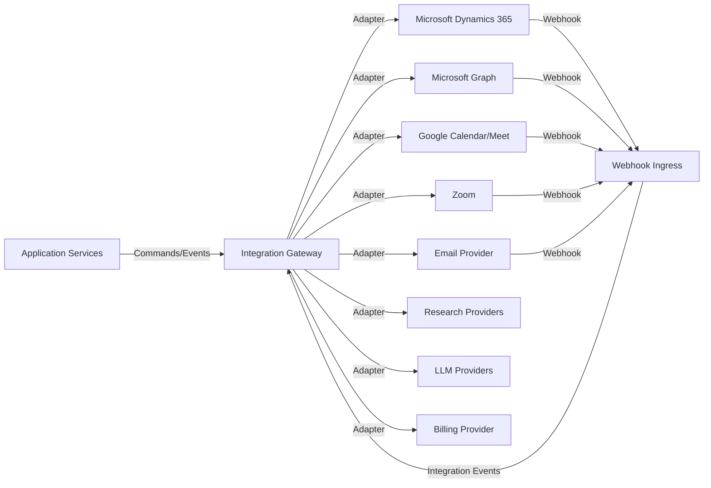

# Integration Architecture

## Integration Patterns

| Pattern | Use Case |
|---|---|
| Adapter | Translate external provider APIs to internal ports |
| Anti-Corruption Layer | Prevent external concepts from leaking into core domain |
| Webhook | Receive inbound events from external systems |
| Polling | When webhooks unavailable or unreliable |
| Outbound API call | Push data to external systems |
| Sync job | Periodic synchronization (CRM, contacts, calendars) |
| Event-driven sync | React to domain events to update external systems |
| File exchange | Bulk imports/exports |

## Integration Gateway

The Integration Gateway centralizes outbound communication with external systems. It provides:

- Provider adapters
- Connection/credential management per tenant
- Rate limiting and retry
- Circuit breakers
- Monitoring
- Failure handling

## External System Adapters

| System | Adapter Responsibilities |
|---|---|
| Microsoft Dynamics 365 | Account/contact/lead/opportunity/activity/meeting sync, anti-corruption layer |
| Microsoft Graph | Email read/send, calendar read/write, user directory |
| Google Calendar / Meet | Calendar and meeting provider |
| Zoom | Meeting provider |
| Email Provider | SMTP/IMAP/send APIs, bounce handling, suppression |
| LinkedIn / messaging | Social messaging where API permits |
| Web Research | Search queries, enrichment |
| LLM Provider | Model inference via LLM Gateway |
| Identity Provider | OIDC/OAuth authentication |
| Billing Provider | Payment events, invoicing |

## Trust Boundary

- External systems are untrusted.
- All inbound data is validated and sanitized.
- Outbound data follows provider schemas.
- Credentials are tenant-scoped and stored in secrets manager.
- Webhook signatures are verified.

## Failure Modes

| Failure | Handling |
|---|---|
| Provider timeout | Retry with backoff |
| Provider rate limit | Backoff, queue, alert |
| Provider outage | Circuit breaker, fallback, queue |
| Auth token expiry | Refresh or notify admin |
| Schema change | Anti-corruption layer isolates impact; adapter updated |
| Invalid response | Log, emit failure event, DLQ |
| Webhook signature invalid | Reject and alert |

## Data Exchange

- Outbound: domain events trigger adapter commands.
- Inbound: webhooks/polling produce integration events mapped to domain events.
- Data mapping is owned by the integration adapter, not core domain.

## Idempotency

- External API calls use provider-specific idempotency mechanisms.
- Inbound webhooks deduplicated by provider ID.
- CRM sync jobs use watermark/checkpoint to avoid duplicate writes.

## Rate Limiting

- Per-tenant and per-provider rate limits.
- Token bucket or leaky bucket algorithms.
- Queue-based smoothing for bursts.

## Security

- mTLS/HTTPS for all external communication.
- OAuth2 / service principals for provider auth.
- Secrets stored externally.
- Outbound requests logged without credentials.
- Webhook endpoints exposed only through API Gateway.

## Integration Architecture Diagram

