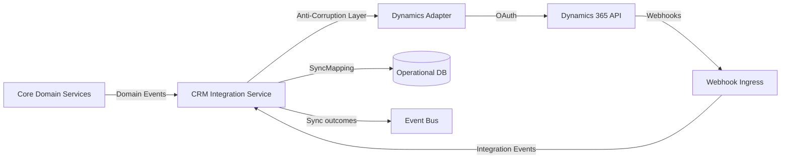

# Dynamics 365 Integration Architecture

## Purpose

Microsoft Dynamics 365 is the initial CRM/ERP integration target. The architecture isolates Dynamics-specific concerns behind an anti-corruption layer and adapter so the core domain remains provider-neutral.

## Scope

- Account synchronization
- Contact synchronization
- Lead synchronization
- Opportunity synchronization
- Activity and task synchronization
- Meeting/appointment synchronization

## Components

| Component | Responsibility |
|---|---|
| Dynamics Adapter | Translate between domain objects and Dynamics entities |
| Connection Manager | Manage tenant-scoped OAuth/service principal credentials |
| Sync Orchestrator | Schedule and coordinate sync jobs |
| Entity Mapper | Map core domain concepts to Dynamics entities |
| Conflict Resolver | Resolve conflicts between domain state and Dynamics state |
| Duplicate Detector | Detect duplicates using domain rules and Dynamics data |
| Change Detector | Detect changes via webhooks or polling |
| Failure Handler | Retry, DLQ, and alert on sync failures |

## Authentication

- OAuth2 / service principal per tenant.
- Tokens stored in secrets manager.
- Token refresh handled by connection manager.
- Admin consent for required scopes.

## Mapping

| Domain Concept | Dynamics Entity | Notes |
|---|---|---|
| Company | Account | Mapping stored in SyncMapping |
| Contact | Contact | Linked to Account |
| Lead | Lead | Qualified lead may become Opportunity |
| Opportunity | Opportunity | Linked to Account/Contact |
| Meeting | Appointment / PhoneCall | Provider-specific |
| Activity | Task / PhoneCall / Email | Activity party mapping |

## Anti-Corruption Layer

- Core domain uses `Company`, `Contact`, `Lead`, `Opportunity`.
- Dynamics IDs are stored in `CRMRecordReference` value objects owned by CRM Integration context.
- No Dynamics-specific fields enter core aggregates.
- Mapping logic is in adapter, not core domain services.

## Synchronization Modes

| Mode | Use Case |
|---|---|
| Real-time event sync | Domain event triggers immediate Dynamics write |
| Scheduled batch sync | Periodic full/incremental sync |
| Webhook inbound | Dynamics change triggers domain event |
| Manual sync | Admin triggers sync on demand |

## Conflict Resolution

- Last-write-wins with domain precedence for core attributes.
- Domain wins for qualification/opportunity stage.
- Dynamics wins for fields owned by CRM users.
- Conflicts logged for manual review.

## Rate Limiting and Retries

- Respect Dynamics API limits.
- Exponential backoff on 429 responses.
- Batched writes.
- DLQ for persistent failures.

## Failure Recovery

- Sync state checkpointed.
- Failed records retried independently.
- Alerts for auth failures and schema changes.
- Manual replay tooling.

## Duplicate Detection

- Domain-level duplicate rules run before sync.
- Dynamics duplicate detection rules used as secondary guard.
- Potential duplicates surfaced to tenant admin.

## Webhooks

- Dynamics webhooks (where available) enter through Integration Gateway.
- Payloads mapped to integration events.
- Events transformed to domain events by anti-corruption layer.

## Testing

- Mock Dynamics API for integration tests.
- Contract tests for adapter mappings.
- Sync failure simulation.

## Dynamics 365 Integration Diagram

