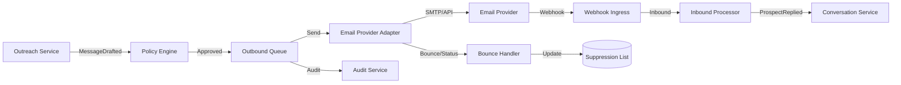

# Email Architecture

## Purpose

The email architecture supports authorized outbound and inbound email communication for outreach and conversation management, with threading, delivery tracking, bounce handling, suppression, opt-out, and audit.

## Components

| Component | Responsibility |
|---|---|
| Email Provider Adapter | Send and receive via SMTP/IMAP/provider API |
| Message Composer | Generate personalized message bodies |
| Thread Manager | Maintain conversation thread identity |
| Delivery Tracker | Track sends, opens, clicks, bounces |
| Bounce Handler | Process bounces and update suppression lists |
| Suppression Manager | Manage opt-outs, bounces, complaints |
| Outbound Queue | Queue outgoing messages with rate limiting |
| Inbound Processor | Process replies and route to conversation service |

## Outbound Flow

1. Outreach or Conversation service generates message.
2. Policy engine checks approval and autonomy.
3. Message queued with tenant ID, recipient, and approval reference.
4. Outbound worker sends via configured provider.
5. Delivery status tracked.
6. Audit record created.
7. `MessageSent` event emitted.

## Inbound Flow

1. Provider delivers inbound email via webhook or polling.
2. Webhook ingress validates and routes to Inbound Processor.
3. Thread Manager matches message to conversation.
4. Content sanitized and validated.
5. `ProspectReplied` event emitted.
6. Conversation service handles reply.

## Message Identity

- Unique message ID per outbound/inbound message.
- Thread ID links messages in a conversation.
- References/In-Reply-To headers preserved.
- Sender address is tenant-branded or system-managed.

## Suppression and Opt-out

- Hard bounces suppress address.
- Manual opt-outs honored immediately.
- Complaints suppress address.
- Suppression is tenant-scoped.
- No message sent to suppressed addresses.

## Rate Limits

- Per-tenant daily/hourly send limits.
- Provider rate limits respected.
- Queue smoothing for bursts.
- Warming for new tenants/senders.

## Provider Failures

- Retry per provider policy.
- Fallback to secondary provider if configured.
- Persistent failures queued for ops review.

## Security

- SPF/DKIM/DMARC for outbound.
- Inbound webhook signature validation.
- No execution of email content.
- Attachments scanned.
- PII redacted in logs.

## Audit

- Every send/receive recorded.
- Includes sender, recipient, message ID, thread ID, provider, result.

## Email Architecture Diagram

