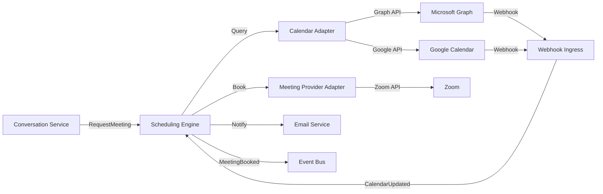

# Calendar and Meeting Architecture

## Purpose

Provide provider-neutral scheduling of meetings using Google Calendar/Meet, Microsoft Graph/Teams, and Zoom, while keeping the core domain free of provider-specific concepts.

## Components

| Component | Responsibility |
|---|---|
| Calendar Adapter | Query availability, create/update/cancel events |
| Meeting Provider Adapter | Generate meeting links (Google Meet, Teams, Zoom) |
| Scheduling Engine | Propose times, handle conflicts, time zones |
| Availability Service | Cache and normalize availability windows |
| Meeting Coordinator | Coordinate between prospect and internal users |
| Conflict Detector | Detect calendar conflicts |

## Supported Providers

| Provider | Calendar | Video |
|---|---|---|
| Microsoft Graph | Yes | Microsoft Teams |
| Google Calendar | Yes | Google Meet |
| Zoom | No native calendar | Zoom Meetings |

## Architecture Principles

- Core domain uses `Meeting`, `MeetingSlot`, `Participant`, `TimeZone`.
- Provider-specific IDs stored in `ExternalMeetingReference`.
- Anti-corruption layer maps provider events to domain events.
- Fallback across providers where tenant has multiple integrations.

## Scheduling Flow

1. Conversation service or mission requests meeting.
2. Scheduling engine queries availability for required calendars.
3. Proposes slots to prospect (or books directly based on autonomy).
4. Prospect selects slot or system books automatically.
5. Calendar adapter creates calendar event.
6. Meeting provider adapter adds video link.
7. `MeetingBooked` event emitted.
8. Invitations sent via email.

## Time Zone Handling

- All times stored in UTC internally.
- Display times converted to participant time zones.
- Time zone inferred from calendar settings or explicit selection.
- DST transitions handled by provider/calendar library.

## Conflict Detection

- Query all relevant calendars before booking.
- Buffer time between meetings configurable.
- Conflict resolution rules per tenant.

## Rescheduling and Cancellation

- Supported via domain commands.
- Provider calendar events updated.
- Participants notified.
- `MeetingRescheduled` or `MeetingCancelled` events emitted.

## Webhooks

- Calendar provider webhooks update meeting state.
- Inbound changes validated and mapped to domain events.
- Polling fallback where webhooks unreliable.

## Failure Handling

- Calendar provider failure: retry, fallback provider, alert.
- If meeting cannot be booked, escalate to human.
- Cancellation must be propagated to all calendars.

## Security

- OAuth tokens per tenant per provider.
- No calendar content exposed to other tenants.
- Meeting links not stored in public logs.

## Calendar/Meeting Architecture Diagram

