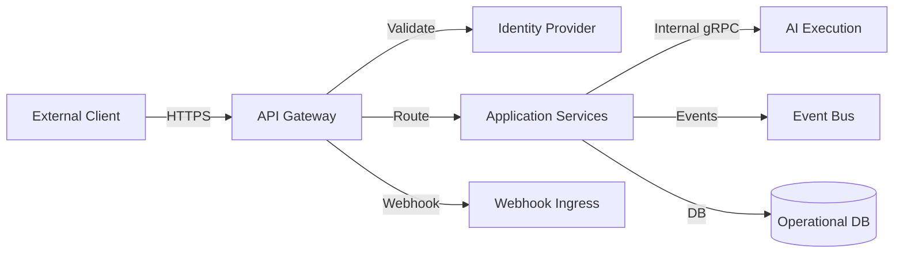

# API Architecture

## API Types

| Type | Audience | Examples |
|---|---|---|
| External REST APIs | Tenant users, admins | Mission API, Lead API, Analytics API |
| External Graph/Webhook APIs | External systems | Webhook ingress |
| Internal APIs | Services | gRPC/REST between services |
| Agent APIs | AI execution plane | Execution commands, result callbacks |

## External API Design

- RESTful resource-oriented design.
- OpenAPI specification published.
- JSON request/response bodies.
- Standard error envelope.
- Pagination, filtering, sorting.
- Tenant context from token or header.

## Authentication

- OIDC/OAuth2 bearer tokens.
- API keys for service accounts (limited).
- Token validation at API Gateway.
- Claims include user ID, tenant ID, roles, permissions.

## Authorization

- RBAC at API Gateway.
- Tenant membership enforced.
- Service-level re-validation.
- ABAC for sensitive actions (e.g., high-value prospect).

## Tenant Routing

- API Gateway extracts tenant from token or custom header.
- Requests routed to tenant-aware services.
- Database queries filtered by tenant.
- Cache keys include tenant.

## Validation

- Request schema validation at gateway and service.
- Business rule validation in domain layer.
- Sanitization of inputs to prevent injection.

## Rate Limiting

- Per tenant.
- Per user.
- Per endpoint.
- Token bucket or fixed window.

## Versioning

- URL path versioning (`/v1/...`).
- Breaking changes in new versions.
- Deprecation window.
- Consumer communication.

## Idempotency

- `Idempotency-Key` header for mutation endpoints.
- Idempotency store with TTL.
- Safe retry semantics.

## Errors

Standard error envelope:

```json
{
  "errorCode": "...",
  "message": "...",
  "correlationId": "...",
  "tenantId": "...",
  "details": []
}
```

## Observability

- Every API request traced.
- Metrics per endpoint, tenant, status.
- Logs redacted of sensitive data.

## Internal APIs

- Service-to-service communication uses gRPC or HTTP with mTLS.
- Contracts shared via internal schemas.
- No direct database access across services.

## API Gateway Responsibilities

- Authentication
- Tenant extraction
- Rate limiting
- Routing
- Request validation
- Response transformation
- CORS
- Logging and tracing
- Webhook ingress

## API Architecture Diagram


