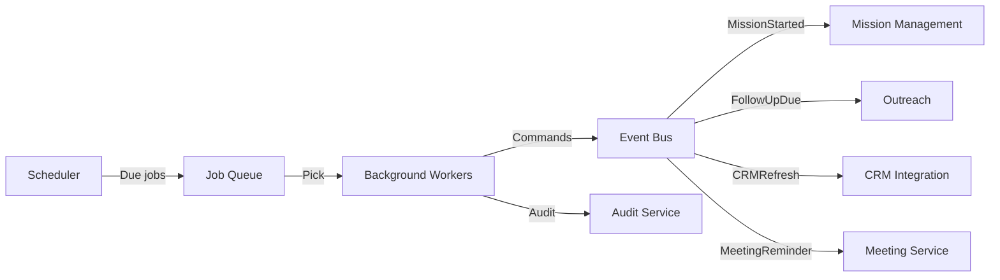

# Scheduling Architecture

## Purpose

The scheduling architecture supports delayed actions, recurring jobs, mission schedules, follow-ups, research refresh, CRM sync, meeting reminders, and agent evaluation.

## Scheduler Responsibilities

- Schedule one-time and recurring jobs.
- Trigger delayed commands.
- Manage job state.
- Retry failed jobs.
- Distribute jobs across workers.
- Support tenant isolation.

## Job Types

| Job Type | Example |
|---|---|
| Mission trigger | Start a scheduled mission |
| Follow-up | Send follow-up after no reply |
| Research refresh | Re-evaluate ICP/company data |
| CRM sync | Periodic reconciliation |
| Meeting reminder | Notify participants |
| ICP refresh | Re-score target account list |
| Agent evaluation | Periodic outcome review |
| Report generation | Daily/weekly analytics |

## Scheduling Mechanisms

| Mechanism | Use Case |
|---|---|
| Cron scheduler | Recurring platform jobs |
| Delayed message queue | Follow-ups, timeouts |
| Workflow timers | Long-running mission timers |
| Event-based | React to MissionStarted, ProspectReplied |
| Polling | When webhooks unavailable |

## Delayed Execution

- Jobs stored with `executeAt` timestamp.
- Worker polls due jobs.
- Alternatively, event bus supports delayed message delivery.
- Jobs are tenant-scoped.

## Recurrence

- Cron expressions or relative intervals.
- Job definitions versioned.
- Skip or pause per tenant.
- Next run computed after successful completion.

## Tenant Isolation

- Scheduler stores tenant ID per job.
- Workers process jobs within tenant context.
- Per-tenant job quotas prevent abuse.

## Reliability

- Jobs persisted before execution.
- At-least-once execution with idempotency.
- Failed jobs retried with backoff.
- DLQ for persistent failures.
- Jobs survive worker restarts.

## Mission Scheduling

- Missions can have start time, end time, recurrence.
- Scheduler emits `MissionScheduled` or `MissionStarted` commands.
- Missions can be paused/rescheduled.

## Follow-up Scheduling

- Follow-ups created by outreach/conversation services.
- Suppressed or cancelled if prospect replies or opts out.
- Autonomy level determines whether follow-up is automatic or pending.

## Scheduling Architecture Diagram

