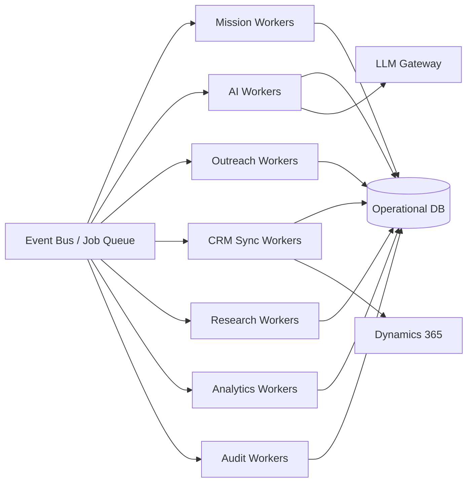

# Background Execution Architecture

## Purpose

Background workers execute asynchronous, long-running, and scheduled tasks outside of user-facing request paths. They support mission execution, CRM sync, email delivery, analytics projection, and audit ingestion.

## Worker Requirements

- **Idempotency**: Each job can be retried safely.
- **Retries**: Exponential backoff with configurable max attempts.
- **Graceful shutdown**: Finish in-flight jobs before termination.
- **Horizontal scaling**: Add workers based on queue depth.
- **Tenant isolation**: Jobs carry tenant context and do not mix data.
- **Mission context**: Long-running mission jobs include mission ID and execution context.
- **Agent context**: AI execution jobs include agent and execution identity.

## Worker Types

| Worker Type | Responsibilities |
|---|---|
| Mission workers | Run mission steps, handle approvals, manage state |
| AI execution workers | Run agent tasks, LLM calls, tool calls |
| Outreach workers | Send outbound messages |
| Inbound processors | Handle replies, bounces, webhooks |
| CRM sync workers | Synchronize with Dynamics 365 |
| Research workers | Enrich companies and contacts |
| Analytics workers | Project events to analytics store |
| Audit workers | Append audit records |
| Scheduler workers | Poll and execute scheduled jobs |

## Job Queue Design

- Queues per workload type to isolate failures and scaling.
- Jobs serialized with tenant ID, correlation ID, payload, retry count.
- Priority queues for urgent jobs (e.g., human approval responses).

## Concurrency and Isolation

- Workers process one job at a time or a bounded number per worker.
- Tenant context loaded per job.
- No shared mutable state across jobs.
- Aggregate-level locking or optimistic concurrency for shared aggregates.

## Graceful Shutdown

- Worker stops accepting new jobs.
- In-flight jobs allowed to complete within timeout.
- Jobs not completed are returned to queue for retry.

## Scaling

- Scale based on queue depth, processing latency, and CPU.
- Independent scaling per worker type.
- Tenant-level concurrency limits prevent noisy neighbor.

## Error Handling

- Retry transient failures.
- Move permanent failures to DLQ.
- Emit failure events.
- Alert operations on DLQ growth.

## Background Execution Diagram

