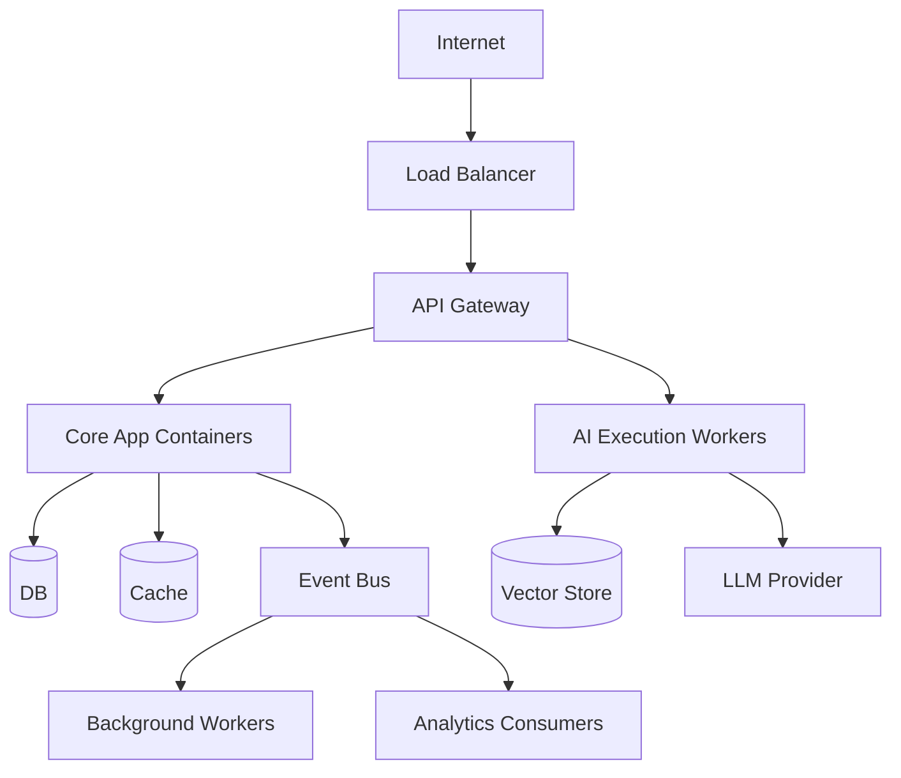

# Deployment Architecture

## Conceptual Deployment

The system is deployed as a set of containerized workloads orchestrated by a container platform. The initial architecture favors a modular monolith plus independent worker pools and services.

## Compute Components

| Component | Deployment Unit | Notes |
|---|---|---|
| API Gateway | Container | External-facing, scalable |
| Core Application | Container(s) | Modular monolith initially |
| AI Execution Workers | Container / pool | Scales with AI workload |
| Background Workers | Container / pools | Separate pools per workload |
| Workflow Engine | Container / service | Durable execution |
| Revenue Analytics | Container / service | Read models |
| Audit Ingestion | Container / worker | Append-only |
| Integration Gateway | Container / adapters | External integrations |
| Feature Flag Service | External or container | Evaluates flags |
| Identity Provider | External SaaS or container | OIDC/OAuth |

## Data Infrastructure

- Operational database (relational, tenant-isolated)
- Vector store (semantic search)
- Analytics store (columnar/OLAP)
- Audit store (append-only)
- Cache cluster
- Object storage
- Event bus cluster
- Secrets manager

## Networking

- Public subnet: API Gateway, webhook ingress, load balancer.
- Private subnet: application services, workers.
- Protected subnet: databases, cache, secrets manager.
- Egress through NAT gateway to external providers.
- Internal service mesh or private endpoints.

## Multi-Region

- Primary region active.
- Secondary region warm standby for DR.
- Data replicated across regions.
- DNS global load balancing for failover.

## Container Requirements

- Stateless containers where possible.
- Configuration via environment variables and secret injection.
- Health checks: liveness, readiness, startup.
- Resource requests and limits.
- Pod/worker anti-affinity for availability.

## Deployment Diagram

## Scaling and Updates

- Rolling deployments with health checks.
- Blue/green or canary for critical services.
- Database migrations applied before code deployment.
- Feature flags decouple release from rollout.

## No Deployment Now

This phase does not deploy infrastructure; it only defines the conceptual deployment architecture.
