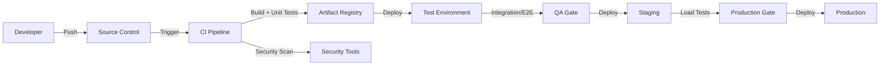

# CI/CD Architecture

## Pipeline Stages

1. **Source Control**
   - Monorepo with domain-aligned modules.
   - Branch protection, required reviews.
   - Commit message conventions.
   - Pre-commit hooks for linting and secrets scanning.

2. **Build**
   - Dependency resolution.
   - Compilation/type checking.
   - Unit tests.
   - Static analysis.
   - Artifact packaging.

3. **Security Scanning**
   - Dependency vulnerability scanning.
   - Static application security testing (SAST).
   - Container image scanning.
   - IaC scanning.
   - Secret detection.

4. **Testing**
   - Integration tests against test environment.
   - Contract tests for APIs and events.
   - E2E workflow tests.
   - AI evaluation tests.
   - Security tests.
   - Load tests (staging).

5. **Artifact Management**
   - Versioned artifacts stored in registry.
   - Immutable tags.
   - Promotion via tags.

6. **Deployment**
   - Infrastructure-as-code if applicable.
   - Rolling or blue/green/canary deployment.
   - Database migrations run before service deployment.
   - Smoke tests and health checks.

7. **Rollback**
   - Automated rollback on health check failure.
   - Database rollback plan where possible.
   - Feature flags as fast rollback mechanism.

## Deployment Strategy

- Continuous Integration on every commit.
- Continuous Delivery to staging.
- Production deployment gated by approvals and tests.
- Canary releases for high-risk changes.

## Branching

- Trunk-based or short-lived feature branches.
- Main branch is always deployable.
- Tags for releases.

## CI/CD Security

- Build environments isolated.
- No secrets in pipeline definitions.
- Signed artifacts.
- Principle of least privilege for deployment roles.
- Audit of all deployments.

## CI/CD Architecture Diagram

