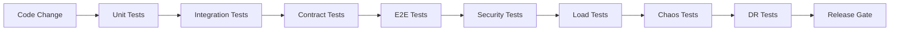

# Testing Architecture

## Testing Layers

| Layer | What It Tests | Risk Validated |
|---|---|---|
| Unit | Domain logic, application services, adapters | Logic correctness |
| Integration | Service/database/event interactions | Component integration |
| Contract | API and event schema compatibility | Breaking changes |
| End-to-End | Critical user/AI workflows | System behavior |
| Workflow | Long-running missions, approvals, retries | Mission durability |
| Agent | AI execution, tool use, output validation | AI behavior correctness |
| AI Evaluation | LLM output quality, safety, policy adherence | Model/task quality |
| Security | Auth, authorization, injection, data isolation | Breaches |
| Load | Throughput, latency, resource usage | Scale limits |
| Chaos | Failure recovery, circuit breakers, fallback | Resilience |
| Disaster Recovery | Backup, restore, failover | Data loss / downtime |

## Test Environments

- Unit and integration tests in CI.
- E2E and workflow tests in Test environment.
- Load and chaos tests in Staging.
- DR drills in isolated DR environment.

## Test Data

- Synthetic data for unit/CI.
- Anonymized production-like data for staging.
- Dedicated test tenants.
- No PII in lower environments.

## Automation

- All tests automated where possible.
- Unit and integration tests run on every commit.
- E2E tests run on staging.
- Security scans run on every build.
- Load tests before major releases.

## AI Evaluation

- Golden dataset for agent tasks.
- Automated scoring for relevance, accuracy, safety.
- A/B evaluation for model/prompt changes.
- Human review for high-stakes changes.

## Observability in Tests

- Tests produce traces and logs.
- Failures correlated with recent changes.
- Test metrics tracked over time.

## Test Architecture Diagram

