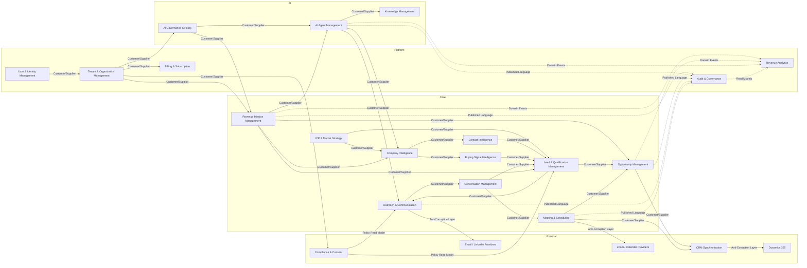

# Context Map

## Relationship Patterns Used

| Relationship | Contexts | Rationale |
|---|---|---|
| Customer/Supplier | Mission Management → AI Agent Management | Mission requests executions; AI Agent Management provides execution outcomes |
| Customer/Supplier | ICP & Market Strategy → Company Intelligence | ICP defines matching rules; Company Intelligence consumes them |
| Customer/Supplier | Lead Management → Outreach & Communication | Lead provides qualified targets; Outreach performs communication |
| Anti-Corruption Layer | Outreach → Email/LinkedIn, Meeting → Calendar, CRM → Dynamics 365 | External provider models must not leak into core domain |
| Published Language | All contexts → Audit & Governance | Common audit event vocabulary |
| Open Host Service | Revenue Analytics | Read-only projections consumed by dashboards |

## Cross-Context Communication Patterns

| From Context | To Context | Pattern | Example |
|---|---|---|---|
| Revenue Mission Management | AI Agent Management | Command + Domain Events | ExecuteTask, AgentExecutionCompleted |
| AI Agent Management | Revenue Mission Management | Domain Events | AgentExecutionCompleted |
| Company Intelligence | Lead & Qualification | Domain Events | CompanyResearched |
| Lead & Qualification | Outreach & Communication | Domain Events | LeadQualified |
| Outreach & Communication | Conversation Management | Domain Events | OutreachSent |
| Conversation Management | Meeting & Scheduling | Commands/Events | RequestMeeting, MeetingBooked |
| Meeting & Scheduling | Opportunity Management | Domain Events | MeetingBooked |
| Opportunity Management | CRM Synchronization | Commands/Events | SyncOpportunityToCRM |
| AI Governance | AI Agent Management | Read Models / Policies | PolicyEvaluationResult |
| Compliance & Consent | Outreach & Communication | Read Models | SuppressionCheck |
