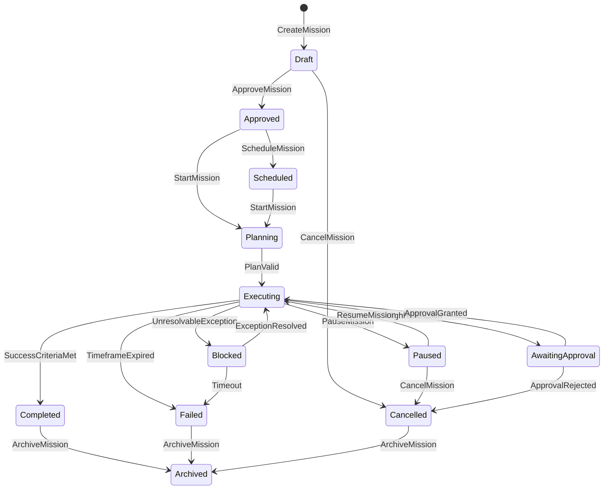
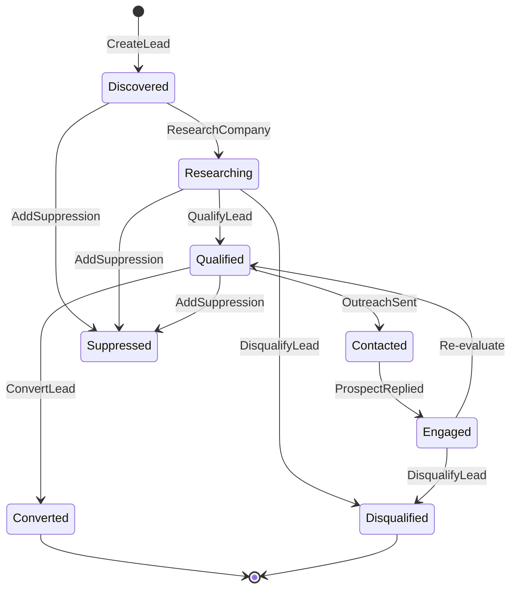
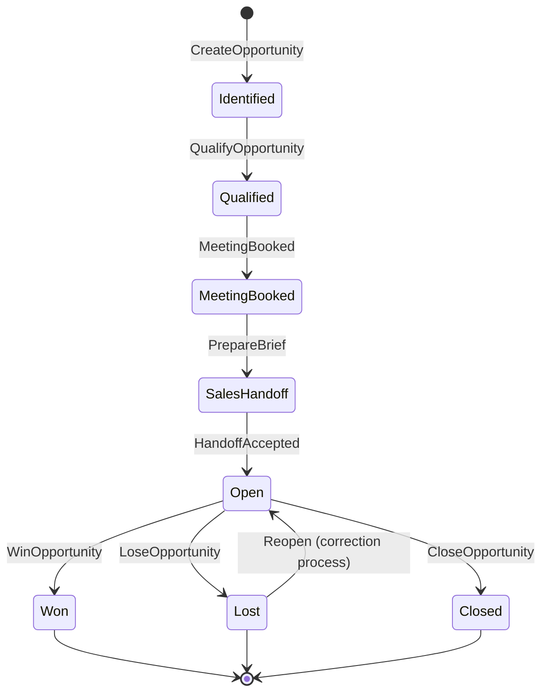
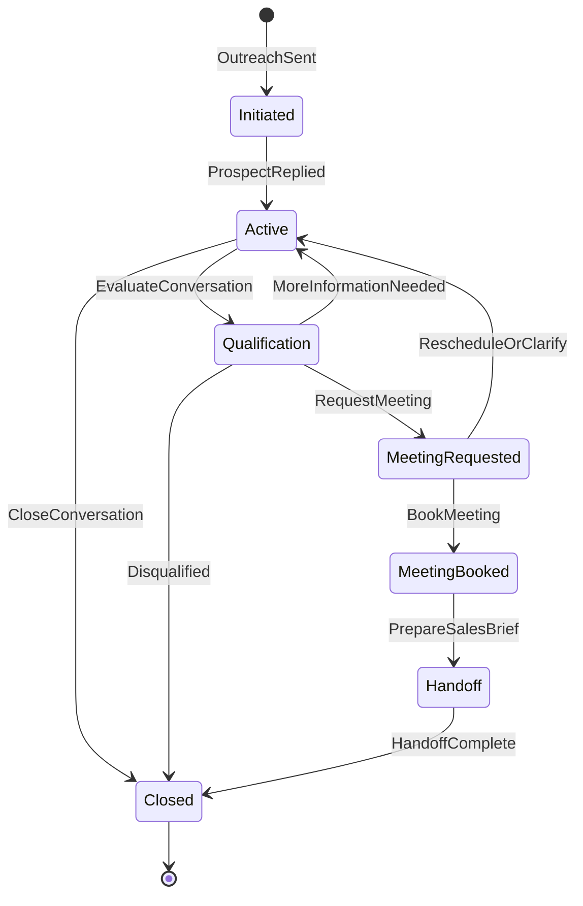
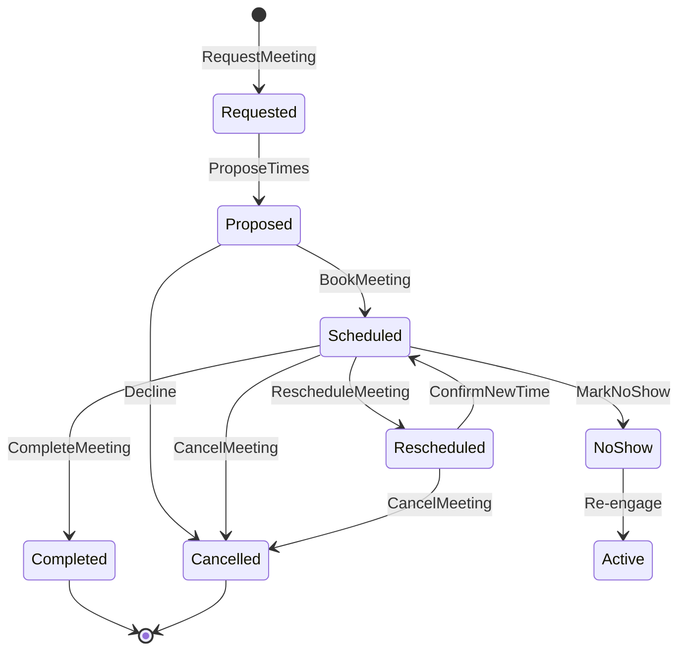
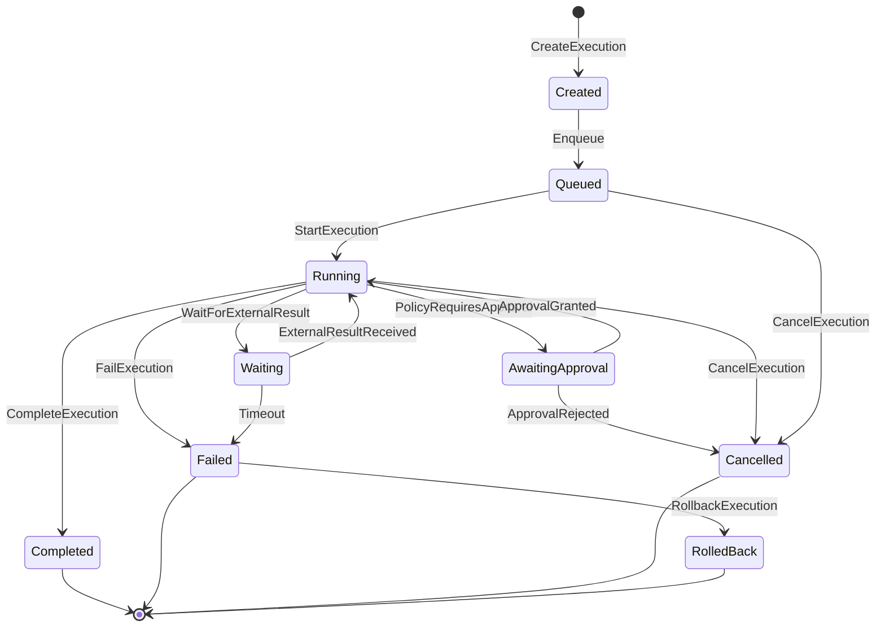

# State Machines

## Mission State Machine

### Allowed Transitions

| From | To | Trigger |
|---|---|---|
| Draft | Approved | Human approval |
| Draft | Cancelled | Human cancellation |
| Approved | Scheduled | Scheduler |
| Approved/Scheduled | Planning | StartMission command |
| Planning | Executing | Plan validation |
| Executing | Paused | Pause command |
| Executing | AwaitingApproval | High-risk action |
| Executing | Blocked | Exception |
| Executing | Completed | Success criteria met |
| Executing | Failed | Timeout or objective unmet |
| Paused | Executing | Resume command |
| Paused | Cancelled | Cancel command |
| AwaitingApproval | Executing | Approval granted |
| AwaitingApproval | Cancelled | Approval rejected |
| Blocked | Executing | Exception resolved |
| Blocked | Failed | Resolution timeout |
| Completed/Failed/Cancelled | Archived | Review complete |

### Forbidden Transitions

- Completed → Executing
- Archived → any state
- Failed → Completed
- Cancelled → Completed
- AwaitingApproval → Planning

## Lead State Machine

### Forbidden Transitions

- Disqualified → Qualified without re-creation
- Converted → Disqualified
- Suppressed → any active state without explicit removal

## Opportunity State Machine

### Forbidden Transitions

- Won → Lost
- Lost → Won
- Won → Open

## Conversation State Machine

### Forbidden Transitions

- Closed → Active without explicit reopen
- MeetingBooked → Initiated

## Meeting State Machine

### Forbidden Transitions

- Completed → Scheduled without correction process
- Cancelled → Scheduled without new request
- Completed → Cancelled

## Agent Execution State Machine

### Forbidden Transitions

- Completed → Running
- Cancelled → Running
- Failed → Completed
- RolledBack → Running
