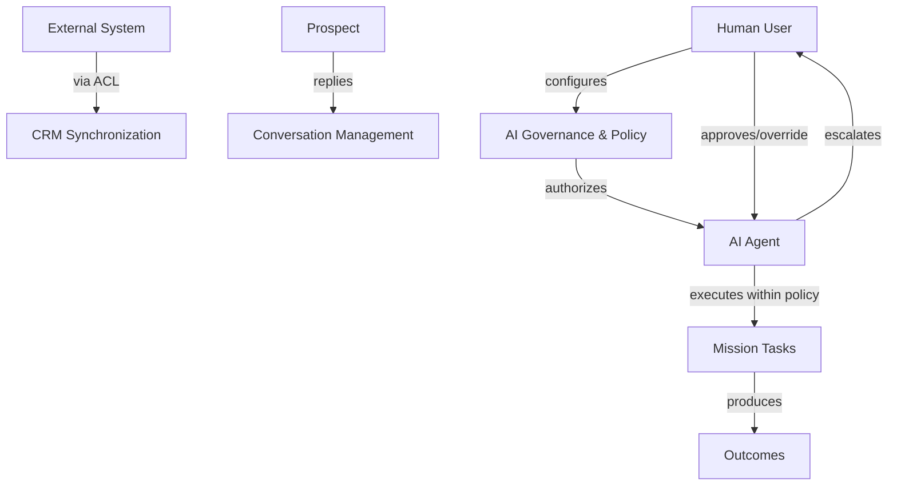

# Human and AI Actors

## Actor Model

The domain recognizes four primary actor types:

1. **Human User**
2. **AI Agent**
3. **External System**
4. **Prospect**

Each actor has identity, authority, permissions, and accountability in the domain.

## Human User

- **Identity**: UserId
- **Roles**: Administrator, Revenue Manager, Sales Manager, Sales Representative, Compliance Administrator, Executive
- **Authority**: Defined by tenant-scoped roles and permissions
- **Permissions**: Configurable per tenant and role
- **Responsibilities**:
  - Configure tenant, ICP, and policies
  - Approve high-risk actions
  - Escalate or override AI decisions
  - Review outcomes and provide feedback
- **Accountability**: Human actions are logged in Audit & Governance

## AI Agent

- **Identity**: AgentId
- **Roles**: Defined by AgentRole and capabilities
- **Authority**: Derived from policies and autonomy levels
- **Permissions**: Limited to registered capabilities and allowed actions
- **Responsibilities**:
  - Execute assigned tasks
  - Record decisions and outcomes
  - Escalate when uncertain or beyond authority
- **Accountability**: Every execution is traceable through AgentExecution and AuditRecord

## External System

- **Examples**: Dynamics 365, Zoom, Microsoft Graph, email providers, research providers
- **Identity**: ConnectionId or external reference
- **Authority**: None in the domain; systems are adapters
- **Permissions**: Limited by integration credentials and provider terms
- **Responsibilities**: Provide or receive data through anti-corruption layers
- **Accountability**: Synchronization actions are logged; failures are domain events

## Prospect

- **Identity**: ContactId or anonymous reference
- **Role**: Target of outreach and engagement
- **Authority**: Can opt out, request human, or decline
- **Permissions**: No direct platform access
- **Responsibilities**: Respond to outreach; provide or withdraw consent where applicable
- **Accountability**: Prospect actions are recorded in Conversation and Consent

## Authority Boundaries

## Human vs AI Action Matrix

| Action | AI Role | Human Role |
|---|---|---|
| Configure tenant | N/A | Owner |
| Define ICP | Recommend | Approve |
| Discover companies | Autonomous within policy | Review/override |
| Research company | Autonomous | Review low-confidence |
| Qualify lead | Recommend/autonomous | Approve borderline |
| Draft outreach | Autonomous draft | Approve high-risk |
| Send low-risk outreach | Autonomous | Monitor |
| Handle routine reply | Autonomous | Take over if complex |
| Schedule meeting | Autonomous within policy | Approve high-value |
| Create CRM opportunity | Autonomous within policy | Verify/enrich |
| Define policy | N/A | Owner |
| Override AI | N/A | Authorized human |
| Audit all actions | Recorded | Review |

## Approval Authority

- **Compliance Administrator**: Can suspend missions, agents, and users; enforce suppression
- **Revenue Manager**: Can approve missions, outreach, ICP changes
- **Sales Manager**: Can approve target contacts, meeting bookings
- **Administrator**: Can configure tenant, integrations, emergency stop
- **Executive**: Can set strategic objectives, view dashboards

## Accountability Principles

- The AI never has unlimited authority.
- Authority is granted by explicit policy and human configuration.
- Every AI action is auditable.
- Humans can override, suspend, or cancel AI actions.
- External systems cannot directly trigger domain actions without going through an ACL and domain command.
