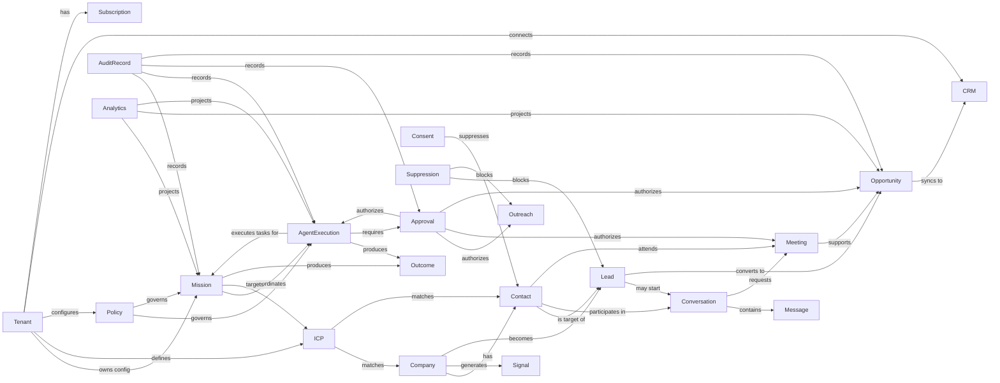

# Domain Relationships

## Relationship Overview

The following diagram shows the primary domain relationships between aggregates and bounded contexts. These are conceptual domain relationships, not database relationships.

## Aggregate Relationship Rules

- **Tenant** owns configuration but does not contain other aggregates.
- **Mission** coordinates executions and references ICP, but does not own Lead, Opportunity, or AgentExecution.
- **ICP** is referenced by Mission and used to evaluate Company and Contact.
- **Company** and **Contact** are independent aggregates; a Contact optionally belongs to a Company by reference.
- **Lead** references Company and Contact; it has its own lifecycle.
- **Conversation** references a Lead or Contact; Messages are within the Conversation aggregate.
- **Meeting** references a Lead/Opportunity and Attendees; it does not own the Opportunity.
- **Opportunity** references Lead and Meeting but owns its own stage and score history.
- **AgentExecution** is independent from Mission; Mission requests tasks and reacts to events.
- **Policy** and **Approval** are referenced but not owned by the aggregates they govern.

## Referencing by Identity

Cross-aggregate references use identity value objects, not object references:

- Mission references ICPProfileId
- Lead references CompanyId and ContactId
- Conversation references LeadId
- Meeting references LeadId or OpportunityId
- Opportunity references LeadId and MeetingId
- AgentExecution references MissionId and AgentId
- Approval references AgentExecutionId or other target IDs

## Many-to-Many Relationships

- A Company may have many Contacts.
- A Company may have many BuyingSignals.
- A Lead may have many Conversations over time.
- A Mission may have many AgentExecutions.
- A Prospect (Contact) may be targeted by multiple Missions over time.

## Temporal Relationships

- Entities can have a history of states and evaluations.
- Qualification, OpportunityStage, and AgentExecutionOutcome are recorded as part of the aggregate's history.
- Audit records are append-only and link related events.

## Relationship Constraints

- A Lead cannot reference a suppressed Contact.
- A Meeting cannot reference an unqualified Lead unless policy explicitly allows.
- An Opportunity must reference a qualified Lead.
- An AgentExecution must reference a Mission and Agent within the same tenant.
