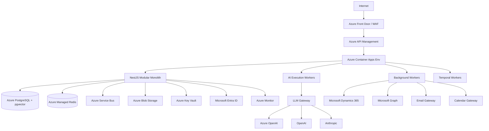

# Production Technology Architecture

## Purpose

This document defines the concrete production technology stack and implementation architecture for the AI-Native Autonomous Revenue Employee, transforming approved Phase 01–05 specifications into technology choices, contracts, and deployment topology.

## Hard Constraints

| Constraint | Value | Source |
|---|---|---|
| Primary cloud | Microsoft Azure | Organizational |
| Primary backend language | TypeScript / Node.js | Organizational |
| Preferred ecosystem | Microsoft / Azure where strategically advantageous | Organizational |
| Provider abstraction | Domain logic must not depend on vendor SDKs | Architecture |

## Recommended Production Stack

| Layer | Technology |
|---|---|
| Cloud | Microsoft Azure |
| Backend runtime | Node.js LTS + TypeScript 5.x |
| Framework | NestJS |
| API Gateway | Azure API Management + Application Gateway / WAF |
| Database | Azure Database for PostgreSQL Flexible Server + pgvector |
| Cache | Azure Managed Redis (Azure Cache for Redis retained only as a legacy/migration alternative) |
| Event bus | Azure Service Bus Premium |
| Webhooks | Azure Event Grid |
| Workflow engine | Temporal (on Azure Container Apps / AKS) |
| Vector storage | PostgreSQL pgvector + Azure AI Search |
| Object storage | Azure Blob Storage |
| LLM platform | Azure OpenAI (primary) + OpenAI/Anthropic fallbacks |
| LLM gateway | Custom TypeScript gateway |
| Agent runtime | Custom TypeScript specialist-agent runtime |
| Identity | Microsoft Entra ID |
| Authorization | Domain policy engine + Entra groups |
| Secrets | Azure Key Vault + Managed Identities |
| Observability | OpenTelemetry + Azure Monitor Application Insights |
| IaC | Bicep primary; Terraform for abstractions |
| Containers | Docker + Azure Container Apps |
| Registry | Azure Container Registry |
| CI/CD | GitHub Actions + Azure Deployment Environments |
| Email | Azure Communication Services Email + Microsoft Graph adapters |
| Calendar/meetings | Microsoft Graph + Zoom/Google adapters |
| Dynamics 365 | Microsoft Dataverse API + Microsoft Graph + Change Tracking |
| Research | Bing Search API + Azure AI Search |
| Analytics | Azure Synapse Analytics / Azure Data Explorer |

## Design Principles

- **Azure-first, not Azure-everything**: Prefer Azure-native only when it materially improves integration, security, reliability, or operations.
- **Replaceability**: Gateways and adapters isolate vendor-specific contracts.
- **Tenant isolation by design**: Enforced technically in DB, cache, events, storage, and observability.
- **Managed services where appropriate**: Reduce undifferentiated operational burden.
- **Avoid premature distribution**: Azure Container Apps initially; AKS path if needed.
- **No implementation yet**: This phase produces decisions, contracts, and topology, not code or resources.

## Reference Topology

## Scope Boundaries

- Technology decisions are made to satisfy Phase 05 AI architecture and Phase 04 system architecture.
- No code, migrations, credentials, or deployed resources are produced.
- All numerical performance targets are marked PROPOSED until measured.
