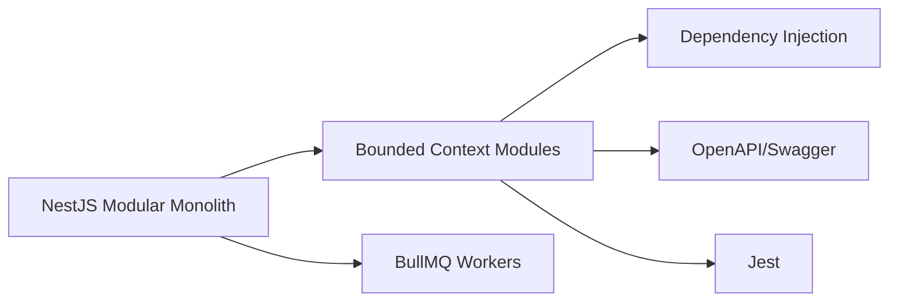

# Backend Stack

## Language Constraint

TypeScript / Node.js is the primary backend language for all application services, workers, API layer, agent orchestration integration, Tool Gateway, integration services, and workflow integration.

## Rationale for TypeScript/Node.js

- Single language across API, domain services, workers, and AI gateway integration.
- Strong async/IO model for event-driven, API, and integration workloads.
- Large ecosystem for OpenAPI, HTTP, testing, observability.
- Organizational constraint aligns with Microsoft ecosystem tooling.

## Framework Selection: NestJS

### Evaluation Matrix

| Criterion | NestJS | Fastify + custom | Express + custom |
|---|---|---|---|
| DDD/modularity | Excellent | Good | Requires custom |
| Dependency injection | Built-in | Limited | Requires custom |
| OpenAPI/Swagger | First-class | Manual | Manual |
| Type safety | Strong | Moderate | Moderate |
| Testing support | Excellent | Good | Good |
| Async execution | Excellent | Excellent | Good |
| Background workers | Via Bull/queues | Custom | Custom |
| AI SDK ecosystem | Compatible | Compatible | Compatible |
| Enterprise readiness | High | Medium | Medium |
| Operational complexity | Moderate | Moderate-High | High |

### Recommendation

**NestJS** is the primary backend framework. It provides modular architecture, DI, decorators, built-in OpenAPI, testing, and a path to microservices extraction via the same module model.

### Module Boundaries

Each bounded context becomes a NestJS module with:

- Domain sub-layer (entities, value objects, aggregates, domain services)
- Application sub-layer (commands, queries, DTOs, use cases)
- Infrastructure sub-layer (adapters, repositories, clients)
- Interface sub-layer (controllers, event handlers, job handlers)

### Async and Worker Support

- Use `@nestjs/bull` or BullMQ with Redis for background job queues.
- Use `@nestjs/event-emitter` or direct Service Bus client for events.
- Use `@nestjs/schedule` for cron-style jobs.
- Use `@nestjs/terminus` for health checks.

## Isolated Specialized Workloads

A different language may be used only if TypeScript/Node.js is technically inappropriate and the workload is isolated behind a clear boundary. Candidates:

- Python for offline ML model evaluation or data-science pipelines (if needed).
- Any such use must be documented as a Proposed ADR and must not contaminate the core architecture.

## Runtime

- Node.js LTS (even-numbered version).
- TypeScript 5.x with strict mode.
- Package manager: pnpm or npm.
- Linting: ESLint + Prettier.
- Testing: Jest.

## Backend Stack Diagram

## Proposed ADR

See `TAD-002 TypeScript/Node.js as Primary Backend Stack` and `TAD-003 NestJS as Backend Framework`.
