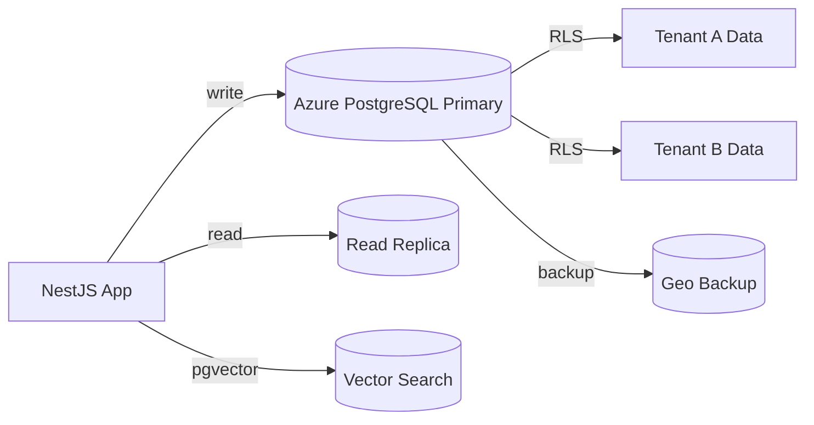

# Database

## Selection: Azure Database for PostgreSQL Flexible Server

### Evaluation Matrix

| Criterion | Azure PostgreSQL Flexible Server | Azure SQL | Azure Cosmos DB |
|---|---|---|---|
| ACID transactions | Excellent | Excellent | Configurable/Eventual |
| Row-Level Security (RLS) | Native | Native | Partial/Complex |
| JSONB for flexibility | Excellent | Moderate | Excellent |
| Vector extension (pgvector) | Yes | No | No native |
| Tenant isolation patterns | Schema + RLS | RLS | Partition key |
| DDD aggregate modeling | Excellent relational | Excellent relational | Document model |
| Read replicas | Yes | Yes | Yes |
| Backup/PITR | Yes (35 days) | Yes | Yes |
| Encryption at rest/transit | Yes | Yes | Yes |
| Managed service maturity | High | High | High |
| Cost | Moderate | Moderate | Variable |

### Recommendation

**Azure Database for PostgreSQL Flexible Server** is the primary transactional database. It supports ACID, RLS, schemas, JSONB, and pgvector, enabling both operational and vector workloads initially.

## Transaction Model

- Use explicit transactions at the aggregate boundary.
- Optimistic concurrency via version columns.
- No long-running transactions; use sagas/workflows for cross-aggregate consistency.
- Unit of Work pattern in application layer.

## Tenant Isolation

| Approach | Use Case |
|---|---|
| Row-Level Security (RLS) | Default tenant filtering on shared tables |
| Per-tenant schemas | Optional for high-isolation tenants or large tenants |
| tenantId column | Present on every tenant-scoped table |
| Application enforces | All queries set tenant context |

## Indexing Strategy

- Primary keys and foreign keys.
- tenantId + entityId composite indexes.
- Partial indexes for active states.
- GIN indexes on JSONB columns.
- B-tree on event timestamps for audit/event tables.

## Connection Management

- Connection pooling with PgBouncer (built into Flexible Server in some tiers or self-managed sidecar).
- Separate read and write connection strings for replicas.
- Tenant context set per connection/session.
- Circuit breaker for DB failures.

## Read Replicas

- Use read replicas for analytics dashboards and heavy read queries.
- Replicas are asynchronous; reads are eventually consistent.

## Backup and Recovery

- Automated backups with point-in-time restore (PITR).
- Geo-redundant backup option for disaster recovery.
- Tested restore procedures.

## Migration Strategy

- Schema migrations via TypeORM/Prisma/migrate tool.
- Migrations run per environment before deployment.
- Tenant schema provisioning automated.
- Data migrations separated from schema migrations.

## Audit Considerations

- Sensitive fields encrypted at application level where required.
- Audit log stored separately to preserve immutability.
- RLS policies also protect audit reads.

## Database Architecture Diagram

## Proposed ADR

See `TAD-004 Azure Database for PostgreSQL Flexible Server as Primary Database`.
