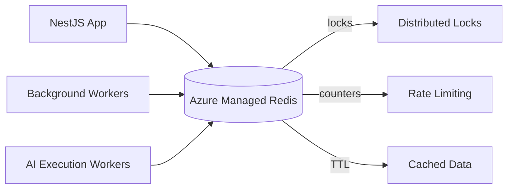

# Cache

## Selection: Azure Managed Redis

### Evaluation Matrix

| Criterion | Azure Managed Redis | Azure Cache for Redis (legacy/migration) | Self-hosted Redis on AKS |
|---|---|---|---|
| Managed service | Yes | Yes | No |
| Distributed locks | Yes | Yes (Redlock) | Yes |
| Pub/sub | Yes | Yes | Yes |
| Persistence | Yes | Yes | Yes |
| Active-Geo | Yes | Premium/Enterprise | Complex |
| Cost | Moderate | Moderate | Lower but operational |
| Operational complexity | Low | Low | High |

### Recommendation

**Azure Managed Redis** for distributed caching, rate-limit counters, idempotency keys, session state, and distributed locks. Azure Cache for Redis is retained only as a legacy or migration alternative.

## Cache Use Cases

| Use Case | Key Pattern | TTL |
|---|---|---|
| Tenant configuration | `tenant:{tenantId}:config` | 5 min |
| User sessions/claims | `session:{sessionId}` | 15 min |
| Rate-limit counters | `rate:{tenantId}:{scope}` | Sliding window |
| Idempotency keys | `idempotency:{key}` | 24 h |
| LLM prompt cache | `prompt:{hash}` | 1 h |
| Hot knowledge items | `knowledge:{tenantId}:{id}` | 10 min |
| Tool adapter results | `tool:{tenantId}:{cacheKey}` | 5 min |

## Tenant Isolation

- All tenant-scoped keys include tenantId.
- No shared keys across tenants for mutable data.
- Global system config keys read-only.

## Eviction and TTL

- Volatile TTL eviction by default.
- Critical items with no TTL protected.
- Cache warming on startup for hot config.

## Distributed Locks

- Use Redlock or Redis `SET NX EX` for short-lived locks.
- Lock keys include aggregate ID.
- Always release with token verification.

## Rate Limiting

- Token bucket or sliding window counters in Redis.
- Per tenant, per user, per API, per provider.

## What Must NEVER Be Stored in Cache

- Secrets, passwords, private keys.
- PII unless encrypted and required for performance.
- Authorization decisions (must be re-evaluated).
- Cross-tenant data.
- Business-critical state that is not recoverable from DB.

## Cache Architecture Diagram

## Proposed ADR

See `TAD-005 Azure Cache for Redis as Cache`.
