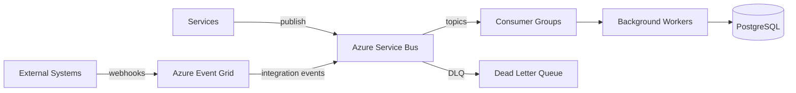

# Event Infrastructure

## Selection: Azure Service Bus Premium

### Evaluation Matrix

| Criterion | Azure Service Bus Premium | Azure Event Hubs | Kafka on AKS | Redis Streams |
|---|---|---|---|---|
| Queues + Topics | Yes | Topics/Partitions | Yes | Yes |
| Delayed/scheduled messages | Yes | No | Add-on | Limited |
| Dead-letter queue | Native | No (needs consumer) | Add-on | Limited |
| Message ordering | Sessions | Partition key | Partition key | Stream order |
| Delivery semantics | At-least-once + idempotent consumers + duplicate detection + outbox/transactional patterns | At-least-once | Configurable | At-least-once |
| Replay | Forward via DLQ | Yes (retention) | Yes | Limited |
| Multi-tenancy | Namespaces / topics | Consumer groups | Topics | Streams |
| Durability | High | High | High | Moderate |
| Operational complexity | Low | Low | High | Low |
| Cost | Moderate | Moderate-High | Higher | Low |

### Recommendation

**Azure Service Bus Premium** as the primary event bus. It provides queues, topics, sessions, scheduled messages, dead-letter queues, transactions, and geo-disaster recovery.

## Canonical Delivery Semantics

The architecture is **at-least-once delivery** plus **idempotent consumers**, **duplicate detection**, **outbox/transactional patterns** where appropriate, **DLQ**, **replay**, and **correlation/causation IDs**.

- Service Bus transactions and duplicate detection protect the broker-side handoff only.
- They do **not** guarantee end-to-end exactly-once processing of business operations.
- Every consumer must be idempotent by tracking processed `eventId` / `correlationId` / `idempotencyKey`.
- Message delivery semantics are separate from business-operation idempotency.

## Event Infrastructure Components

| Component | Role |
|---|---|
| Azure Service Bus | Commands, domain events, integration events |
| Azure Event Grid | Inbound webhooks from external systems |
| Azure Managed Redis | Lightweight in-process pub/sub where appropriate |

## Topic/Queue Design

| Channel | Type | Purpose |
|---|---|---|
| `domain.events` | Topic | Broadcast domain events |
| `{context}.commands` | Queue | Point-to-point commands |
| `agent.commands` | Queue | AI task commands |
| `crm.commands` | Queue | CRM sync commands |
| `outreach.commands` | Queue | Outreach commands |
| `analytics.events` | Topic | Analytics projections |
| `audit.events` | Topic | Audit ingestion |
| `dlq` | DLQ | Failed messages |

## Consumer Groups

- One consumer group per subscriber service.
- Independent scaling per consumer group.
- Consumer lag monitoring via Azure Monitor.

## Retry and DLQ

- Max delivery count per subscription/queue.
- Exponential backoff for transient failures.
- DLQ inspection tooling.
- Replay from DLQ after fix.

## Ordering

- Use Service Bus sessions for aggregate-ordered processing where needed.
- Most consumers are idempotent and handle out-of-order events.
- Ordering not guaranteed globally; consumers use state checks.

## Idempotency

- Event IDs and idempotency keys stored in Redis/DB with TTL.
- Consumers check processed IDs before handling.
- Commands carry idempotency keys.

## Event Envelope

```json
{
  "eventId": "uuid",
  "eventType": "MissionApproved",
  "eventVersion": "1.0",
  "occurredAt": "2026-08-08T12:00:00Z",
  "tenantId": "tenant-uuid",
  "missionId": "mission-uuid",
  "agentId": "agent-uuid",
  "executionId": "execution-uuid",
  "correlationId": "uuid",
  "causationId": "uuid",
  "producer": "MissionManagementService",
  "payload": { ... },
  "metadata": { }
}
```

## Tenant Isolation

- tenantId in every message.
- Consumer filters/processes within tenant context.
- Use sessions per tenant for ordering where needed.
- Separate namespaces per environment; not per tenant (cost).

## Event Infrastructure Diagram



## Proposed ADR

See `TAD-006 Azure Service Bus as Event Infrastructure`.
