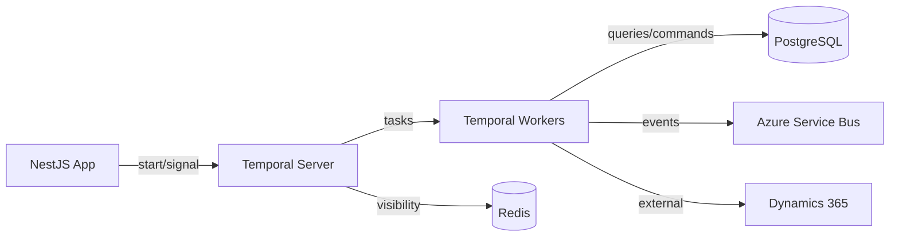

# Workflow Engine

## Selection: Temporal

### Evaluation Matrix

| Criterion | Temporal | Azure Durable Functions | Cadence |
|---|---|---|---|
| Long-running workflows | Excellent | Good | Excellent |
| Durable timers | Excellent | Good | Excellent |
| Signals / external events | Excellent | Good | Excellent |
| Cancellation | Excellent | Moderate | Excellent |
| Pause/resume | Excellent | Moderate | Excellent |
| Compensation / sagas | Excellent | Moderate | Excellent |
| Versioning | Excellent | Moderate | Good |
| Multi-tenant namespaces | Yes | No | No |
| Language SDK | TS/JS, Python, Go, Java, .NET | .NET/JS/PowerShell | TS/JS experimental |
| Observability | Excellent UI + metrics | Azure Monitor | Moderate |
| Operational complexity | Moderate | Low | Moderate |
| Cost | Compute + storage | Serverless consumption | Similar to Temporal |

### Recommendation

**Temporal** is the workflow engine. It provides durable execution, timers, signals, versioning, cancellation, and compensation required for long-running revenue missions. The concrete deployment target on Azure (Azure Container Apps vs. AKS) is a candidate, not a production-validated default. Phase 07 must validate the full Temporal operational topology before committing to a platform.

## Deployment on Azure — Candidate, Requires Validation

- Temporal Server deployed on Azure Container Apps or AKS.
- PostgreSQL as persistence store (Azure PostgreSQL).
- Azure Managed Redis as visibility store.
- Temporal Workers as separate ACA apps.
- TLS and managed identities for internal communication.

## Workflow Use Cases

| Workflow | Purpose |
|---|---|
| Mission Execution | Coordinate discovery → outreach → conversation → meeting → opportunity |
| Outreach Approval | Pause for human approval with timeout |
| Meeting Scheduling | Poll for prospect response, book meeting |
| CRM Sync Retry | Retry with backoff, escalate on failure |
| Follow-up Cadence | Timed follow-up sequence |

## Key Capabilities

- **Timers**: Wait hours/days/weeks without active process.
- **Signals**: Resume from external events (approval, reply, webhook).
- **Cancellation**: Abort workflow cleanly with compensation.
- **Versioning**: Update workflow logic without breaking in-flight runs.
- **Compensation**: Reverse partial work on failure.

## Multi-Tenancy

- Separate Temporal Namespaces per tenant group or use a shared namespace with tenant context in workflows.
- For strong isolation, provision namespaces per tenant tier.
- All workflow state encrypted at rest.

## Phase 07 Temporal-on-Azure Validation Checklist

Before treating any platform choice as production-validated, the following must be evaluated:

| Area | Validation Required |
|---|---|
| Frontend | Can the Temporal frontend run reliably on ACA or does it need AKS load-balancing / headless service behavior? |
| History | Storage throughput/latency on Azure PostgreSQL; shard sizing if scaling beyond single DB |
| Matching | Task-queue scaling and partition behavior under worker load |
| Worker services | Worker process health, long-poll reliability, reconnect behavior on ACA |
| Persistence | Backup/restore procedures, connection pooling, failover testing |
| Visibility | Azure Managed Redis visibility store sizing and query latency |
| High availability | Multi-replica frontend/history/matching topology; AZ spread |
| Backup | Automated PostgreSQL backups plus workflow archival to Blob Storage |
| Restore | Documented point-in-time restore and workflow resumption procedure |
| Upgrades | Server version upgrade plan and worker SDK compatibility matrix |
| Version compatibility | Temporal server/SDK version combinations locked and tested |
| Namespace strategy | Shared vs. tenant-group vs. per-tenant namespaces with isolation trade-offs |
| Tenant isolation | Workflow context carries tenantId; no cross-tenant workflow signal leakage |
| Networking | Private endpoints, mTLS/TLS, service discovery, DNS |
| Private connectivity | No public exposure of Temporal frontend or gRPC endpoints |
| Autoscaling | Worker scaling rules (CPU, memory, task backlog); server resource plans |
| Observability | Metrics, traces, logs from server and SDK to Azure Monitor |
| Disaster recovery | Cross-region failover, RPO/RTO for persisted workflow state |
| Operational ownership | Runbooks, on-call responsibilities, incident response |

## Operational Considerations

- Back up workflow persistence via PostgreSQL backups.
- Monitor workflow execution latency and failure rates.
- Archival of completed workflows to Blob Storage for long-term retention.

## Workflow Engine Diagram

## Proposed ADR

See `TAD-007 Temporal as Workflow Engine`.
