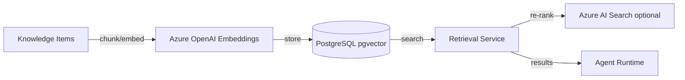

# Vector Storage

## Selection: PostgreSQL pgvector (initial) + Azure AI Search (scale path)

### Evaluation Matrix

| Criterion | PostgreSQL + pgvector | Azure AI Search | Pinecone | Weaviate |
|---|---|---|---|---|
| Managed in Azure | Yes (Flexible Server) | Yes | No | Marketplace |
| Vector indexing | ivfflat/hnsw | Vector + semantic + keyword | Optimized | Optimized |
| Metadata filtering | Good | Excellent | Good | Good |
| Hybrid search | Basic | Excellent | Moderate | Good |
| Re-ranking | Basic | Built-in | Add-on | Add-on |
| Tenant isolation | Schema/RLS/filter | Index/filter | Namespace | Class/filter |
| Scale | Moderate | High | High | High |
| Operational complexity | Low | Low | Medium | Medium |
| Cost | Low | Moderate-High | Moderate | Moderate |

### Recommendation

Start with **pgvector** in Azure PostgreSQL Flexible Server for simplicity and to avoid extra infrastructure. Use **Azure AI Search** for advanced hybrid retrieval, re-ranking, and scale when knowledge volume or query performance demands it.

## Embedding Strategy

| Aspect | Decision |
|---|---|
| Provider | Azure OpenAI text-embedding-3-large / small |
| Dimensions | 3072 (large) / 1536 (small) |
| Distance metric | Cosine similarity |
| Index | hnsw when available; ivfflat fallback |
| Chunking | Semantic chunks with overlap; preserve metadata |

## Chunking and Metadata

- Chunk size target: 512–1024 tokens with overlap.
- Metadata includes: tenantId, knowledgeId, source, category, confidence, freshness, tags.
- Store original content in Blob Storage for large documents; vector store holds chunks.

## Tenant Isolation

- Filter all queries by tenantId.
- Optional separate collections/schemas for high-tier tenants.
- Embeddings do not leak across tenants.

## Retrieval and Re-ranking

- Initial retrieval: vector similarity top-K.
- Pre-filter by metadata (category, freshness, tenant).
- Re-ranking via Azure AI Search semantic ranker or cross-encoder if adopted.
- Hybrid: combine vector + keyword scores.

## Versioning

- Embedding model version recorded with each knowledge item.
- Re-embedding strategy on model change: incremental, batched, background.
- Versioned vector indexes if needed.

## Deletion

- Soft-delete knowledge items; remove from index.
- Hard-delete per tenant retention policy.

## Vector Storage Diagram

## Proposed ADR

See `TAD-008 PostgreSQL pgvector + Azure AI Search for Vector/Hybrid Retrieval`.
