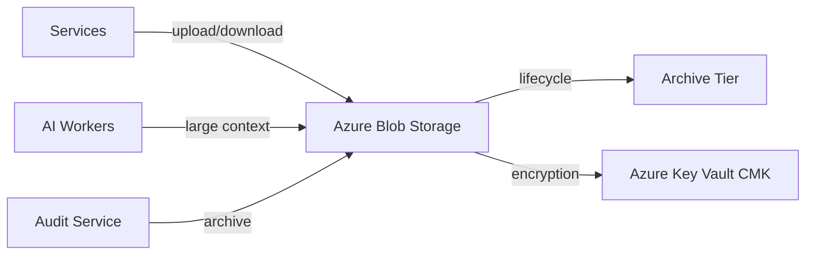

# Object Storage

## Selection: Azure Blob Storage

### Evaluation Matrix

| Criterion | Azure Blob Storage | Azure Files | S3 via adapter | GCS via adapter |
|---|---|---|---|---|
| Native Azure integration | Excellent | Good | External | External |
| Durability | Very high | Very high | Very high | Very high |
| Lifecycle management | Excellent | Moderate | Excellent | Excellent |
| Tiering (hot/cool/archive) | Yes | Limited | Yes | Yes |
| Encryption | SSE, CMK | SSE | SSE | SSE |
| Private endpoints | Yes | Yes | Via network config | Via network config |
| Cost | Low | Moderate | Similar | Similar |
| Tenant isolation | Prefix + RBAC | Share-level | Prefix + IAM | Prefix + IAM |

### Recommendation

**Azure Blob Storage** for all object storage needs: documents, research artifacts, email attachments, exports, large execution artifacts, audit archives, and model outputs.

## Use Cases

| Use Case | Path Pattern |
|---|---|
| Research artifacts | `tenants/{tenantId}/research/{artifactId}` |
| Email attachments | `tenants/{tenantId}/attachments/{messageId}` |
| Large execution context | `tenants/{tenantId}/executions/{executionId}/context` |
| Audit archives | `system/audit/{year}/{month}/{tenantId}` |
| Evaluation datasets | `system/evaluations/{datasetId}` |
| Exports | `tenants/{tenantId}/exports/{exportId}` |

## Tenant Isolation

- Every tenant-scoped path begins with `tenants/{tenantId}/`.
- RBAC/ABAC enforces tenant access.
- SAS tokens scoped to tenant prefix where needed.
- Container-level separation for sensitive tenants if required.

## Security

- Private Endpoints for internal access.
- HTTPS/TLS in transit.
- SSE with platform-managed keys default; CMK option for high compliance.
- No public containers.
- Signed URLs with short expiry for external access.

## Lifecycle and Retention

- Hot tier for active data.
- Cool tier for older mission data.
- Archive tier for audit/evaluation archives per policy.
- Lifecycle rules per tenant prefix.

## Encryption

- Server-side encryption at rest.
- Customer-managed keys via Azure Key Vault for sensitive tenants.

## Object Storage Diagram

## Proposed ADR

See `TAD-009 Azure Blob Storage for Object Storage`.
