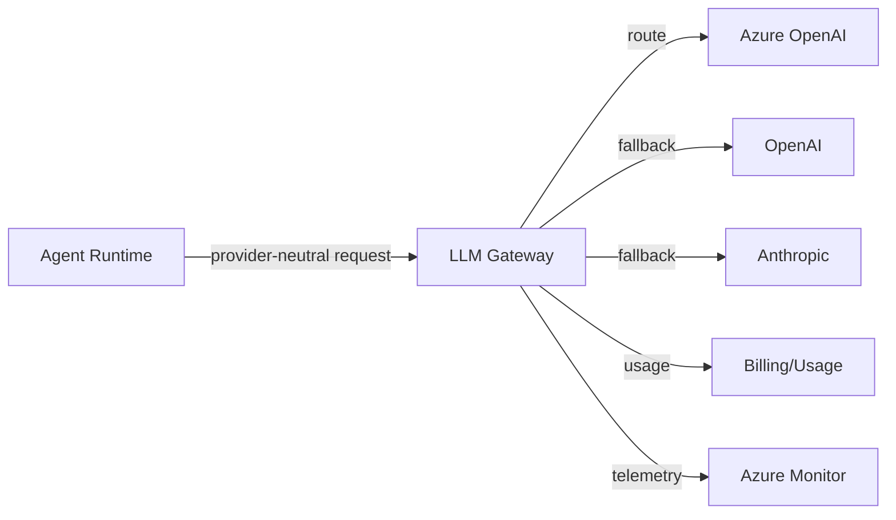

# LLM Platform

## Selection: Azure OpenAI Service (primary) with OpenAI and Anthropic fallback adapters

### Evaluation Matrix

| Criterion | Azure OpenAI | OpenAI Direct | Anthropic | Google Vertex AI |
|---|---|---|---|---|
| Azure integration | Excellent | None | None | Moderate |
| Enterprise controls | Excellent | Moderate | Moderate | Good |
| Data handling | Enterprise DPA | Standard | Standard | Enterprise |
| Region availability | Growing | Wide | US/EU | Wide |
| Model quality | GPT-4o, o3-mini, embeddings | Same | Claude 3.5 | Gemini |
| Private networking | Yes | No | No | Yes |
| Content filtering | Built-in | Limited | Limited | Moderate |
| Cost | Enterprise negotiated | Pay-as-you-go | Pay-as-you-go | Variable |
| Fallback value | Primary | Good | Good | Good |

### Recommendation

**Azure OpenAI Service** is the primary LLM platform. It provides enterprise data handling, private endpoints, content filtering, identity integration, and region deployment. OpenAI and Anthropic are maintained as fallback providers via the LLM Gateway.

## Model Selection

| Purpose | Recommended Azure OpenAI Model | Fallback |
|---|---|---|
| Complex reasoning / planning | o3-mini / GPT-4o | Claude 3.5 Sonnet |
| Message generation | GPT-4o mini / GPT-4o | GPT-4o via OpenAI |
| Classification / extraction | GPT-4o mini | Claude Haiku |
| Tool use | GPT-4o | Claude 3.5 Sonnet |
| Embeddings | text-embedding-3-large / small | text-embedding-3 via OpenAI |

## Azure OpenAI Configuration

- Deploy per region for latency and quota.
- Use managed identity for authentication.
- Private endpoint in VNet.
- Content filters and abuse monitoring configured.
- Quota and rate-limit monitoring.
- Per-tenant usage tracking via gateway.

## LLM Gateway Responsibilities

- Provider adapter abstraction
- Model routing by task, cost, latency, quality
- Fallback and retry
- Token and cost tracking
- Timeout management
- Output parsing
- Privacy classification

## Fallback Strategy

1. Retry Azure OpenAI with exponential backoff.
2. Route to OpenAI API (if approved by policy).
3. Route to Anthropic (if approved by policy).
4. Degrade to simpler/cached response or human escalation.

## Privacy and Compliance

- Data residency: choose Azure OpenAI region accordingly.
- No cross-tenant prompt sharing.
- Sanitized logs only.
- Evaluate Microsoft data handling commitments.

## LLM Platform Diagram

## Proposed ADR

See `TAD-010 Azure OpenAI as Primary LLM Provider with Gateway Abstraction`.
