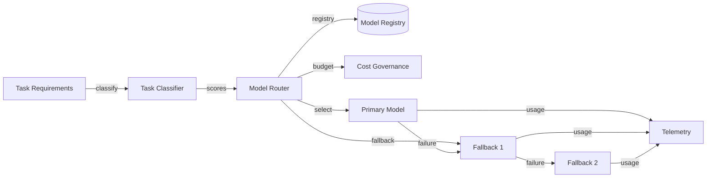

# Model Routing

## Purpose

Route LLM requests to the most appropriate model/provider based on task requirements while preserving provider abstraction and cost control.

## Routing Dimensions

| Dimension | How Used |
|---|---|
| Task type | Research, reasoning, extraction, generation, tool use |
| Complexity | Simple classification vs multi-step planning |
| Latency requirement | Interactive (<2s) vs background (tolerates 30s+) |
| Cost budget | Prefer cheaper model if quality sufficient |
| Quality requirement | High-stakes decisions need stronger model |
| Context length | Choose model with adequate context window |
| Privacy class | Some data may be restricted to Azure OpenAI |
| Provider health | Avoid unhealthy or rate-limited providers |

## Routing Rules (Examples)

| Task | Primary | Fallback | Notes |
|---|---|---|---|
| Simple extraction | GPT-4o mini | GPT-4o | Low cost, fast |
| Research synthesis | GPT-4o | Claude 3.5 | Reasoning quality |
| Complex planning | o3-mini / GPT-4o | Claude 3.5 Sonnet | Multi-step reasoning |
| Outreach generation | GPT-4o | GPT-4o mini if latency budget low | Quality + brand |
| Conversation reply | GPT-4o mini | GPT-4o | Interactive latency |
| High-risk action validation | GPT-4o / o3-mini | Claude 3.5 | Strong validation |
| Embeddings | text-embedding-3-large | text-embedding-3-small | Dimension/cost trade-off |

## Routing Implementation

- Model Registry stored in PostgreSQL.
- Router service in TypeScript as part of LLM Gateway.
- Scoring function across dimensions.
- Tenant policy overrides (e.g., restrict to Azure OpenAI).
- Budget enforcement from AI Cost Governance.

## Fallback Logic

- Exponential backoff on primary.
- Switch provider on persistent failure or rate limit.
- Degrade gracefully to cheaper model if quota exceeded.
- For critical tasks, human escalation if no suitable model.

## Cost and Token Tracking

- Input/output tokens per request.
- Cost per model/provider.
- Aggregation per tenant, mission, execution, task.
- Real-time budget checks.

## Model Routing Diagram

## Proposed ADR

Model routing is part of `TAD-010 Azure OpenAI as Primary LLM Provider with Gateway Abstraction`.
