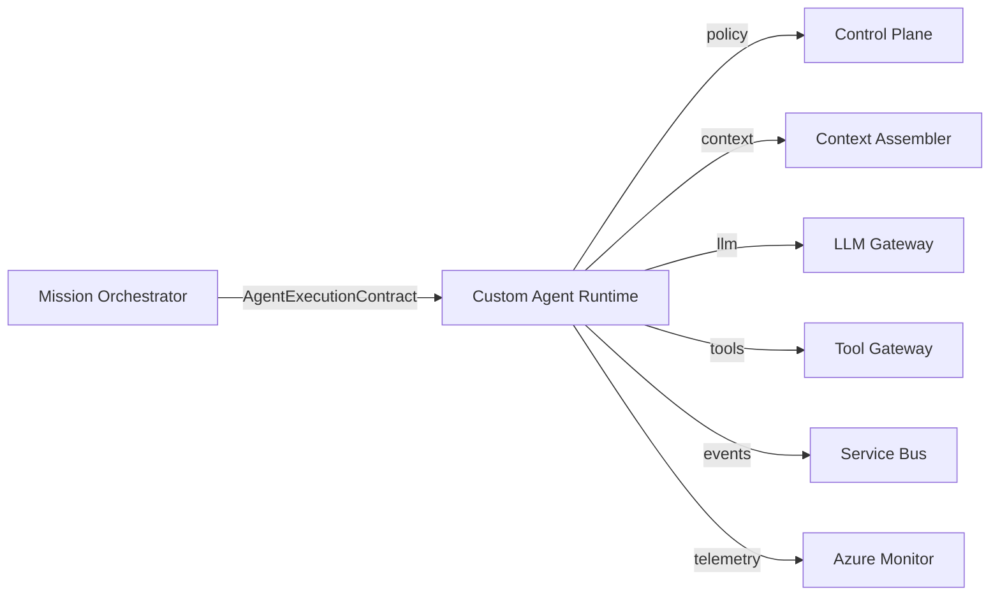

# Agent Framework

## Selection: Custom TypeScript Specialist-Agent Runtime

### Evaluation Matrix

| Criterion | Custom TypeScript Runtime | LangGraph / LangChain | Semantic Kernel | OpenAI Agents SDK |
|---|---|---|---|---|
| Domain architecture control | Excellent | Poor (framework owns flow) | Moderate | Poor |
| TypeScript maturity | High | Moderate | Experimental | Moderate |
| AI SDK ecosystem | Build selectively | Large | Microsoft-aligned | OpenAI-specific |
| Multi-agent topology | Defined by us | Graph-based | Plugins/ planners | Agents |
| Policy enforcement integration | Native | External hooks | External hooks | External hooks |
| Observability/control | Full | Partial | Partial | Partial |
| Vendor lock-in | Low | LangChain-specific | Microsoft | OpenAI |
| Maintainability | High (our contracts) | Framework churn | Moderate | Moderate |

### Recommendation

Build a **custom TypeScript specialist-agent runtime** that implements the approved AI topology (Mission Orchestrator → Planner → Specialist Agents → Policy → Tool Gateway). Use libraries like LangChain or the native OpenAI SDK only inside provider adapters or for prompt conveniences; the framework must not own the domain architecture.

## Why Custom

- Domain architecture is intentionally separated and must not be subordinated to a framework.
- LangGraph's graph model would impose its own topology and risk bypassing our policy boundaries.
- Semantic Kernel's TypeScript support is not production-ready and is heavily Microsoft-centric.
- OpenAI Agents SDK is provider-specific and would couple runtime to OpenAI.

## Permitted Library Use

| Library | Allowed Use |
|---|---|
| OpenAI SDK / Azure OpenAI SDK | LLM client inside provider adapters |
| LangChain (select packages) | Prompt templating, parser helpers, embedding utilities (not orchestration) |
| Zod / JSON Schema | Structured output validation |
| BullMQ | Job queues |
| Temporal SDK | Workflow definitions |
| `@nestjs/*` | Application framework |

## Agent Runtime Components

- Agent Executor
- Planner integration
- Context Assembler
- Reasoning Engine
- Decision Engine
- Tool Executor
- LLM Router integration
- Output Validator
- Memory/Knowledge retrievers
- Telemetry collector
- Recovery handler

## Integration Points

- Exposes `AgentExecutionContract` to Mission Orchestrator / Temporal.
- Calls Control Plane for policy evaluation.
- Calls Tool Gateway for external actions.
- Emits events to Azure Service Bus.

## Agent Framework Diagram

## Proposed ADR

See `TAD-011 Custom TypeScript Agent Runtime over Off-the-Shelf Agent Framework`.
