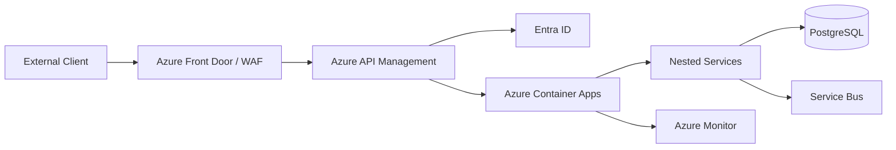

# API Architecture

## Style

RESTful, resource-oriented, API-first with OpenAPI contracts. Internal service calls use gRPC or strongly typed HTTP where appropriate.

## API Gateway

**Azure API Management (APIM)** is the primary API gateway. It handles:

- External client routing
- Authentication via Entra ID
- Tenant extraction from token or header
- Rate limiting per tenant/user/endpoint
- Request validation
- CORS
- Caching
- API versioning
- Logging and correlation ID injection
- Webhook ingress routing

Application Gateway or Azure Front Door sits in front for WAF, DDoS, and TLS termination.

## API Types

| Type | Technology | Use Case |
|---|---|---|
| External REST | HTTP/JSON + OpenAPI | Tenant users, admins |
| Internal REST/gRPC | HTTP/2 + protobuf | Service-to-service synchronous calls |
| Webhooks | HTTPS + signature validation | Inbound external events |
| Commands | Azure Service Bus queues | Asynchronous actions |
| Events | Azure Service Bus topics | Pub/sub notifications |
| Queries | REST + read models | Dashboards, lists |

## Authentication

- External: OAuth2/OIDC via Microsoft Entra ID.
- Internal: Managed Identities + Entra service principals.
- Machine-to-machine: client credentials flow.

## Authorization

- JWT claims include tenant ID, user ID, roles, permissions.
- Service layer re-validates tenant membership and permissions.
- ABAC for sensitive actions (e.g., high-value prospect data).

## Versioning

- URL path versioning: `/v1/...`.
- Breaking changes in new version with deprecation window.
- AsyncAPI versioning for events.

## Idempotency

- `Idempotency-Key` header for mutations.
- Idempotency store in Redis with TTL.
- Safe retry semantics documented per endpoint.

## Rate Limiting

| Scope | Limit Type |
|---|---|
| Tenant | Requests per minute/hour |
| User | Requests per minute |
| IP | DDoS protection |
| Endpoint | Specific throttling |

## Error Model

Standard error envelope:

```json
{
  "errorCode": "TENANT_NOT_FOUND",
  "message": "Tenant not found or access denied.",
  "correlationId": "uuid",
  "tenantId": "uuid",
  "details": []
}
```

## Observability

- OpenTelemetry instrumentation on all APIs.
- Distributed tracing with correlation IDs.
- Metrics per endpoint, tenant, status.
- Log Analytics integration.

## API Architecture Diagram



## Proposed ADR

API gateway and architecture decisions are documented under `TAD-016 Azure Container Apps as Primary Runtime Platform` and related ADRs.
