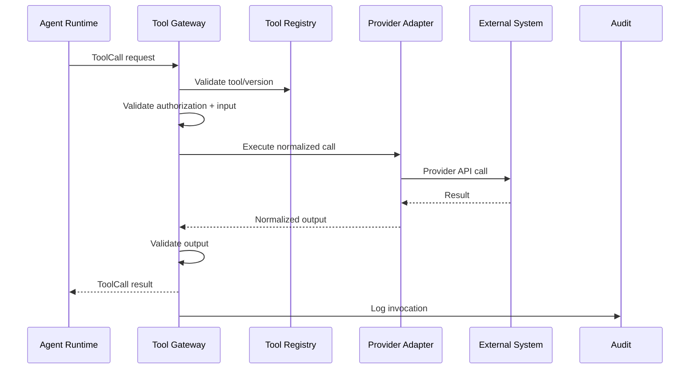

# Tool Contract

## Purpose

Canonical contract for a tool invocation through the Tool Gateway. Ensures every external action is authorized, validated, audited, and tenant-scoped.

## Tool Call Request

```json
{
  "toolCallId": "uuid",
  "toolId": "SendEmail",
  "toolVersion": "1.0.0",
  "tenantId": "tenant-uuid",
  "missionId": "mission-uuid",
  "agentId": "agent-uuid",
  "agentVersion": "1.2.3",
  "executionId": "execution-uuid",
  "taskId": "task-uuid",
  "correlationId": "uuid",
  "authorization": {
    "policyDecisionId": "uuid",
    "decision": "ALLOW",
    "capabilities": ["DraftOutreach", "SendEmail"],
    "expiresAt": "..."
  },
  "riskCategory": "MEDIUM",
  "input": {
    "to": "...",
    "subject": "...",
    "body": "...",
    "campaignId": "..."
  },
  "timeoutSeconds": 30,
  "idempotencyKey": "uuid",
  "metadata": { }
}
```

## Tool Call Result

```json
{
  "toolCallId": "uuid",
  "status": "SUCCESS",
  "output": {
    "messageId": "...",
    "providerReference": "...",
    "sentAt": "..."
  },
  "validation": {
    "schemaValid": true,
    "tenantIsolationCheck": true,
    "piiCheck": "PASSED"
  },
  "startedAt": "...",
  "completedAt": "...",
  "provider": "AzureCommunicationEmail",
  "retryCount": 0,
  "auditId": "uuid"
}
```

## Status Values

- SUCCESS
- VALIDATION_ERROR
- PROVIDER_ERROR
- TIMEOUT
- UNAUTHORIZED
- POLICY_DENIED
- FAILED

## Tool Gateway Responsibilities

- Validate tool is registered and version exists.
- Verify authorization token/decision from Control Plane.
- Validate input against schema.
- Enforce an `idempotencyKey` on every externally mutating operation.
- Route to correct provider adapter.
- Enforce tenant-scoped credentials.
- Execute with timeout and retry.
- Validate output.
- Record audit telemetry.
- Return structured result.

## Idempotency Keys for Mutating Operations

Every tool call that produces an external side effect (create, update, delete, send, schedule) MUST carry an `idempotencyKey` scoped to `tenantId + toolId + operation`. The Tool Gateway and provider adapters MUST deduplicate or reject retries that would repeat the side effect. Read-only operations may omit the key but SHOULD still include `correlationId` and `toolCallId`.

| Operation Type | Requires Idempotency Key |
|---|---|
| CRM create/update/delete | Yes |
| Email send | Yes |
| Meeting create/update/cancel | Yes |
| Outreach create/send | Yes |
| Data export | Yes |
| Read/query | No (recommended correlationId) |

## Provider Adapter Contract

Each adapter translates between domain tool call and provider-specific API. Adapters:

- Accept normalized tool input.
- Use provider SDK with tenant-scoped credentials.
- Return normalized output or structured error.
- Do not leak provider details to domain.

## Tool Registry

```json
{
  "toolId": "SendEmail",
  "version": "1.0.0",
  "description": "Send outbound email",
  "inputSchema": { },
  "outputSchema": { },
  "requiredCapabilities": ["SendEmail"],
  "riskCategory": "MEDIUM",
  "allowedProviders": ["AzureCommunicationEmail", "SendGrid"],
  "defaultProvider": "AzureCommunicationEmail",
  "timeoutSeconds": 30,
  "maxRetries": 3
}
```

## Security

- Authorization decision required; no direct tool invocation.
- Input/output schema validation.
- Tenant credential isolation.
- PII detection on output.
- No secrets in tool inputs.

## Tool Contract Diagram


