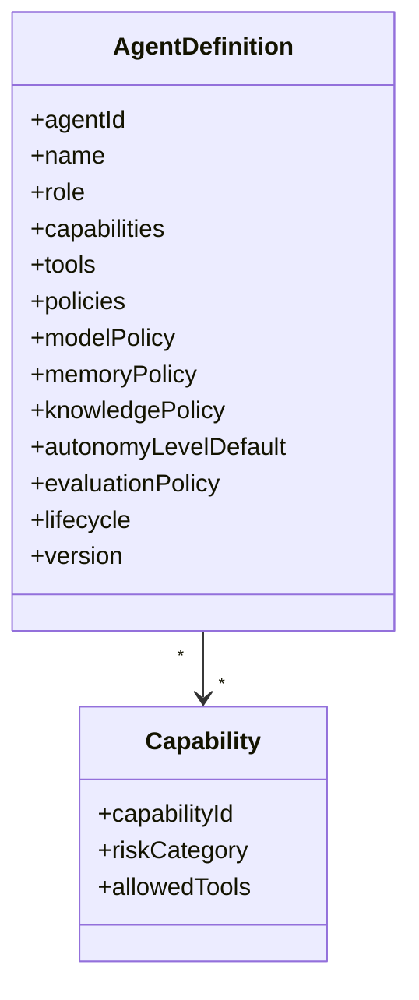

# Agent Contract

## Purpose

Canonical contract defining an agent, its capabilities, policies, and runtime configuration.

## Agent Definition

```json
{
  "agentId": "uuid",
  "name": "Research Agent",
  "role": "Research",
  "description": "Discovers and enriches companies and contacts",
  "capabilities": ["ResearchCompany", "EnrichContact"],
  "tools": ["SearchWeb", "EnrichCompany"],
  "policies": [
    { "policyId": "...", "version": "1.0.0" }
  ],
  "modelPolicy": {
    "preferredModelFamily": "gpt-4o",
    "maxCostPerTaskUsd": 0.10,
    "maxTokensPerTask": 5000
  },
  "memoryPolicy": {
    "read": ["CompanyMemory", "ContactMemory"],
    "write": ["EpisodicMemory"],
    "validationRequired": true
  },
  "knowledgePolicy": {
    "read": ["MarketKnowledge", "CompanyIntelligence"],
    "write": []
  },
  "autonomyLevelDefault": 3,
  "evaluationPolicy": {
    "criteria": ["researchAccuracy", "sourceReliability"],
    "minScore": 0.75
  },
  "lifecycle": "ACTIVE",
  "owner": "platform-team",
  "version": "1.2.3",
  "createdAt": "...",
  "updatedAt": "..."
}
```

## Capability Definition

```json
{
  "capabilityId": "ResearchCompany",
  "name": "Research Company",
  "description": "...",
  "riskCategory": "LOW",
  "allowedTools": ["SearchWeb", "EnrichCompany"],
  "requiredPolicies": ["ResearchSourcePolicy"]
}
```

## Lifecycle States

- DRAFT
- TESTING
- APPROVED
- ACTIVE
- DEPRECATED
- RETIRED

## Versioning

- Immutable published versions.
- Semantic versioning.
- Executions reference a specific version.
- Rollback to previous approved version supported.

## Contract Elements

| Element | Description |
|---|---|
| Agent identity | Unique ID, name, role |
| Capabilities | What the agent is allowed to do |
| Tools | Which tools can be used under capabilities |
| Policies | Applied policies and versions |
| Model policy | Model preferences and budget |
| Memory policy | Read/write memory permissions |
| Knowledge policy | Knowledge access permissions |
| Autonomy default | Default autonomy level |
| Evaluation policy | Success criteria and thresholds |
| Lifecycle | Current lifecycle state |
| Version | Specific immutable version |

## Agent Contract Diagram


