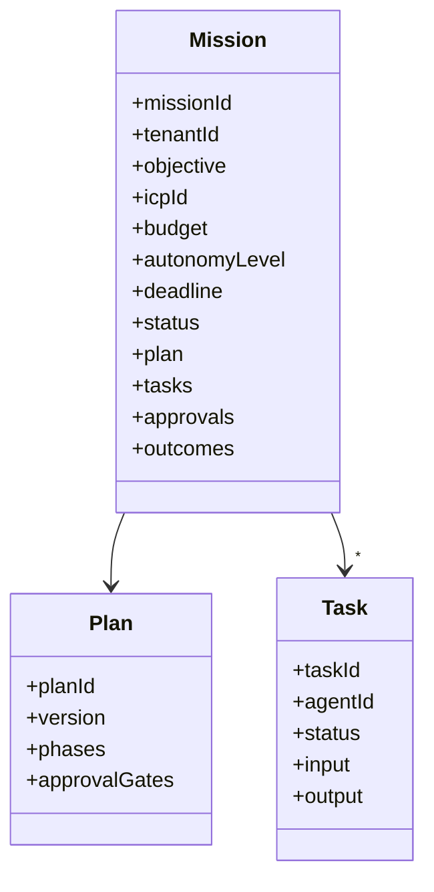

# Mission Contract

## Purpose

Canonical contract defining a revenue mission, its objective, constraints, plan, state, tasks, approvals, and audit context.

## Mission Definition

```json
{
  "missionId": "uuid",
  "tenantId": "tenant-uuid",
  "name": "Q3 Manufacturing Expansion",
  "objective": "Generate qualified opportunities in manufacturing",
  "icpId": "uuid",
  "territory": ["US", "Canada"],
  "channels": ["email"],
  "budget": {
    "maxAiCostUsd": 500,
    "maxOutreachCount": 1000
  },
  "autonomyLevel": 3,
  "constraints": {
    "workingHours": "9-17 EST",
    "noContactDomains": ["competitor.com"],
    "minimumCompanySize": 100
  },
  "successCriteria": {
    "targetMeetings": 10,
    "targetOpportunities": 5
  },
  "deadline": "2026-09-30T23:59:59Z",
  "ownerUserId": "uuid",
  "status": "PLANNING",
  "plan": {
    "planId": "uuid",
    "version": "1",
    "phases": [ ]
  },
  "tasks": [ ],
  "approvals": [ ],
  "outcomes": {
    "meetingsBooked": 0,
    "opportunitiesCreated": 0
  },
  "createdAt": "...",
  "updatedAt": "..."
}
```

## Mission States

- DRAFT
- APPROVED
- SCHEDULED
- PLANNING
- EXECUTING
- PAUSED
- AWAITING_APPROVAL
- BLOCKED
- COMPLETED
- FAILED
- CANCELLED
- ARCHIVED

## Plan Contract

```json
{
  "planId": "uuid",
  "missionId": "uuid",
  "version": 1,
  "objectives": [ ],
  "phases": [
    {
      "phaseId": "...",
      "name": "Research",
      "tasks": [ ],
      "approvalGate": null,
      "fallback": { }
    }
  ],
  "approvalGates": [ ],
  "fallbackBranches": [ ]
}
```

## Task Contract

```json
{
  "taskId": "uuid",
  "missionId": "uuid",
  "planId": "uuid",
  "agentId": "uuid",
  "agentVersion": "1.2.3",
  "taskType": "ResearchCompany",
  "status": "PENDING",
  "input": { },
  "output": { },
  "dependsOn": [ ],
  "deadline": "...",
  "approvalGateId": null
}
```

## Mission Contract Diagram


