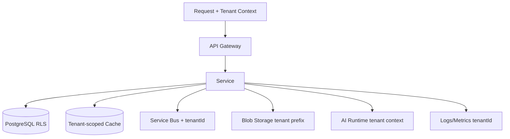

# Multi-Tenancy Implementation

## Principle

Tenant isolation must be technically enforceable, not dependent solely on developer discipline. Every tenant-scoped operation carries explicit tenant context and is isolated at every layer.

## Tenant Context Propagation

| Layer | Mechanism |
|---|---|
| API Gateway | Extract tenant from JWT claim or `X-Tenant-Id` header |
| Service layer | Pass tenant context as part of request/job context |
| Domain layer | tenantId part of aggregate identity and invariants |
| Database | RLS + tenantId columns + per-tenant schemas optional |
| Cache | tenantId in all tenant keys |
| Events | tenantId in event envelope |
| Service Bus | Sessions or topic filters by tenantId |
| Workers | tenant context loaded per job; no cross-tenant batching |
| AI execution | tenant context in context assembler, memory, knowledge |
| Vector store | tenantId metadata filter or separate collections |
| Blob storage | tenantId prefix in path |
| Audit | tenantId in every record |
| Observability | tenantId dimension in logs/metrics/traces |

## Database Isolation

### Row-Level Security (RLS)

```sql
ALTER TABLE companies ENABLE ROW LEVEL SECURITY;
CREATE POLICY tenant_isolation_policy ON companies
  USING (tenant_id = current_setting('app.current_tenant')::UUID);
```

- Set tenant context on each connection or transaction.
- All application queries automatically filtered.
- Superuser/platform queries can bypass with explicit policy.

### Per-Tenant Schemas

- Optional for high-tier tenants or regulatory requirements.
- Migration tooling applies schema migrations to all tenant schemas.
- Connection routing by tenant.

## Cache Isolation

```
Key: tenant:{tenantId}:entity:{id}
Key: tenant:{tenantId}:config
Key: tenant:{tenantId}:rate:{scope}
```

- No shared mutable cache entries across tenants.
- Global system config keys are read-only.

## Event Bus Isolation

- tenantId in every message.
- Consumers filter/process within tenant context.
- Service Bus sessions keyed by tenantId where ordering required.
- No consumer mixes tenant data in memory.

## Worker Isolation

- Job payload includes tenantId.
- Workers set tenant context before processing.
- Long-running workflows scope state by tenant.
- Batch jobs iterate tenants separately or with tenant filter.

## Vector Store Isolation

- pgvector: filter by tenantId metadata.
- Azure AI Search: filter by tenantId field.
- Separate indexes/collections for high-tier tenants if needed.

## Object Storage Isolation

```
tenants/{tenantId}/...
```

- RBAC scoped to tenant prefix.
- SAS tokens scoped to tenant path.

## Observability Isolation

- Logs enriched with tenantId.
- Metrics include tenantId dimension.
- Traces carry tenantId.
- Dashboards enforce tenant membership.

## Cross-Tenant Access

- Platform administrators have explicit cross-tenant roles.
- Cross-tenant reads are logged and audited.
- Cross-tenant writes require break-glass approval.

## Multi-Tenancy Implementation Diagram



## Proposed ADR

Multi-tenancy implementation is governed by `TAD-004 Azure Database for PostgreSQL Flexible Server` and the existing ADR-054 Multi-Tenancy Model.
