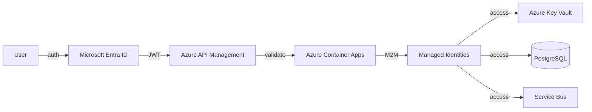

# Identity

## Selection: Microsoft Entra ID

### Evaluation Matrix

| Criterion | Microsoft Entra ID | Auth0 | Okta | Keycloak |
|---|---|---|---|---|
| Azure integration | Excellent | Moderate | Moderate | None |
| Dynamics 365 / Graph SSO | Excellent | Requires federation | Requires federation | Possible |
| Enterprise readiness | Excellent | Excellent | Excellent | Good |
| Service principals / managed identities | Excellent | Moderate | Moderate | Custom |
| B2B/B2C support | Excellent | Good | Good | Moderate |
| Conditional access / MFA | Excellent | Good | Good | Moderate |
| Cost | Included in M365/Azure | Subscription | Subscription | Self-hosted cost |

### Recommendation

**Microsoft Entra ID** is the identity provider for workforce users, service principals, and managed identities. It integrates with Azure OpenAI, Dynamics 365, Microsoft Graph, and Azure API Management.

## Identity Actors

| Actor | Identity Type | Managed By |
|---|---|---|
| Platform Administrator | Entra user | Entra |
| Customer Administrator | Entra user / guest | Entra |
| Revenue Manager / Sales Rep | Entra user / guest | Entra |
| Application Services | Managed Identity / Service Principal | Azure |
| Background Workers | Managed Identity | Azure |
| AI Execution Workers | Managed Identity | Azure |
| External API clients | Service principal / app registration | Entra |

## Authentication Flows

### External Users

1. Client authenticates via Entra ID.
2. Token contains user ID, tenant ID, roles, permissions.
3. API Management validates token.
4. Service layer re-validates claims and tenant membership.

### Service-to-Service

1. Managed Identity requests token from Azure AD.
2. Token presented to downstream service.
3. Downstream validates audience, issuer, roles.

### External Integrations (Dynamics 365 / Graph)

- OAuth2 / service principal.
- Admin consent for required scopes.
- Tokens stored in Key Vault; refresh handled by connection manager.

## Tenant Identity

- Each customer tenant maps to an Entra tenant or directory.
- Internal tenant ID used in application; Entra tenant ID stored in Tenant aggregate.
- Multi-tenant SaaS app registration supports all customer tenants.

## Session Management

- Stateless API; tokens validated per request.
- Refresh tokens handled by Entra.
- Optional session cache in Redis for token metadata (no secrets).

## Identity Diagram

## Proposed ADR

See `TAD-012 Microsoft Entra ID for Identity`.
