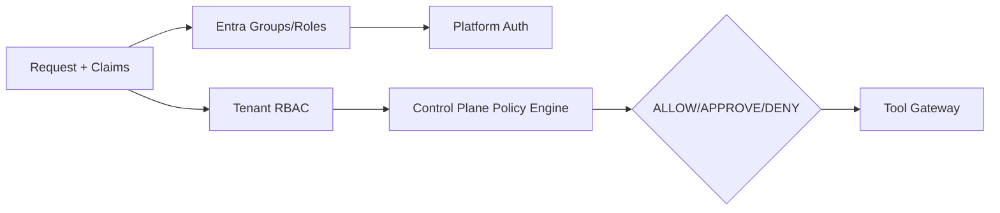

# Authorization

## Approach

Hybrid authorization combining Microsoft Entra ID groups/roles for platform-level access and a domain policy engine for tenant-scoped, mission-scoped, and AI-specific permissions.

## RBAC

| Role | Scope | Permissions |
|---|---|---|
| Platform Admin | Platform | Manage tenants, global settings, security |
| Customer Admin | Tenant | Manage users, integrations, billing, policies |
| Revenue Manager | Tenant/Mission | Create missions, approve outreach, view analytics |
| Sales Manager | Tenant | View pipeline, meetings, team performance |
| Sales Representative | Tenant | View assigned leads/meetings, provide feedback |
| Compliance Admin | Tenant/Platform | Define policies, emergency stop, audit |
| Agent | System | Execute tasks within capabilities and policies |

## ABAC

Used for fine-grained decisions such as:

- High-value prospect access
- Sensitive data exposure
- Approval authority based on deal size or risk
- Autonomy level adjustments

## Authorization Layers

| Layer | Enforcement |
|---|---|
| API Gateway | Validate token, tenant membership, rate limits |
| Service layer | Re-validate permissions, tenant context |
| Domain layer | Enforce aggregate invariants and tenant scope |
| Database | RLS enforces tenant isolation |
| AI Control Plane | Policy engine decides ALLOW/APPROVE/DENY |
| Tool Gateway | Capability and policy check per tool call |

## Policy Evaluation

- Control Plane Policy Engine evaluates action context.
- Combines system, tenant, mission, agent, and action policies.
- Returns ALLOW / REQUIRE_APPROVAL / DENY.
- Approval tasks routed to humans with appropriate role.

## Permission Model

```json
{
  "permission": "mission:approve",
  "scope": "tenant:{tenantId}",
  "conditions": {
    "autonomyLevel": "<= 3",
    "dealValue": "< 100000"
  }
}
```

## Emergency Stop

- Compliance/Platform admin can suspend tenant, mission, or agent.
- Suspension propagated via events.
- All emergency actions audited.

## Authorization Diagram



## Proposed ADR

Authorization is integrated with `TAD-012 Microsoft Entra ID for Identity` and AI Control Plane design.
