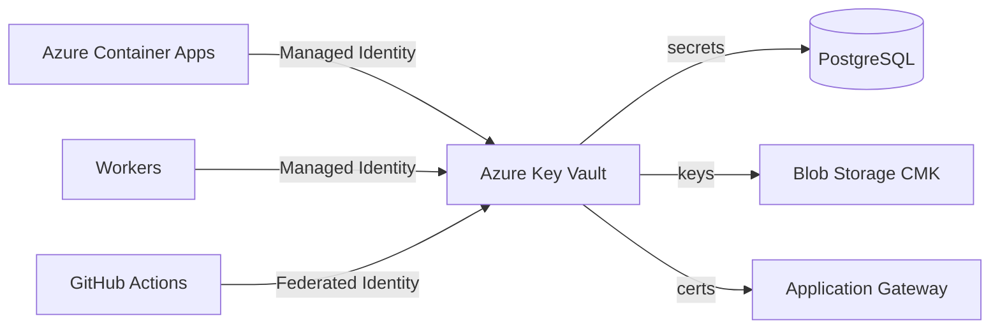

# Secrets Management

## Selection: Azure Key Vault

### Evaluation Matrix

| Criterion | Azure Key Vault | AWS Secrets Manager | HashiCorp Vault | Azure App Config |
|---|---|---|---|---|
| Azure integration | Excellent | External | External | Good |
| Managed identities | Excellent | IAM roles | Tokens | Excellent |
| Rotation | Good | Good | Excellent | N/A |
| HSM | Premium SKU | Yes | Enterprise | No |
| Audit logging | Excellent | Good | Excellent | Moderate |
| Operational complexity | Low | External | High | Low |

### Recommendation

**Azure Key Vault** is the secrets manager for API keys, connection strings, OAuth tokens, certificates, and encryption keys. Access is granted via Managed Identities and Azure RBAC.

## Secret Categories

| Category | Examples | Storage |
|---|---|---|
| Provider API keys | Azure OpenAI, OpenAI, Anthropic, Bing | Key Vault secrets |
| Database credentials | PostgreSQL, Redis | Key Vault secrets + Managed Identity where possible |
| OAuth tokens | Dynamics 365, Graph, Zoom, Google | Key Vault secrets; refresh handled by service |
| TLS certificates | API gateway | Key Vault certificates |
| Encryption keys | CMK for storage/database | Key Vault keys |

## Access Patterns

- Managed Identities for Azure services access Key Vault.
- Service principals for external integrations.
- Developers never see production secrets.
- CI/CD injects Key Vault references, not values.

## Rotation

- Automated rotation for supported secrets where possible.
- Manual rotation runbooks for provider API keys.
- Rotation events logged and audited.
- Graceful rollover without downtime.

## Environment Separation

- Separate Key Vault per environment (dev, test, staging, production).
- No sharing of production secrets with lower environments.
- Naming conventions by environment.

## Audit

- All Key Vault access logged to Azure Monitor / Log Analytics.
- Alerts on anomalous access.
- Regular access review.

## Secrets in Application

- Application reads secrets at startup or on-demand via Key Vault SDK.
- Connection strings never in logs or config files.
- Memory-only; no persistent storage.

## Secrets Diagram

## Proposed ADR

See `TAD-013 Azure Key Vault for Secrets`.
