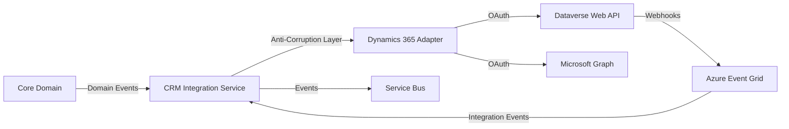

# Dynamics 365 Integration

## Approach

Integration with Microsoft Dynamics 365 is performed through the Microsoft Dataverse Web API and Microsoft Graph, authenticated via OAuth2 / service principals. All Dynamics-specific concepts remain behind an anti-corruption layer.

## Evaluation Matrix

| API | Strengths | Weaknesses |
|---|---|---|
| Dataverse Web API | Full CRUD on accounts, contacts, leads, opportunities, activities | Rate limits, complex metadata |
| Microsoft Graph | Email, calendar, user directory | Limited compared to Dataverse for CRM entities |
| Dynamics 365 SDK | Rich .NET ecosystem | Not TypeScript-native; requires adapter |

### Recommendation

Use **Dataverse Web API** for CRM entity operations and **Microsoft Graph** for email/calendar integration. Build TypeScript adapters that translate between domain concepts and Dynamics entities.

## Authentication

- Service principal per tenant.
- OAuth2 client credentials flow.
- Scopes: `https://{org}.crm.dynamics.com/.default`.
- Tokens stored in Key Vault; refreshed by connection manager.

## Change Tracking

- Use Dataverse change tracking (`Prefer: odata.track-changes`) for incremental sync.
- Maintain watermark per entity/table per tenant.
- Webhooks for real-time notifications where supported.

## Entity Mapping

| Domain Concept | Dynamics Entity | Mapping Owned By |
|---|---|---|
| Company | Account | CRM Integration Adapter |
| Contact | Contact | CRM Integration Adapter |
| Lead | Lead | CRM Integration Adapter |
| Opportunity | Opportunity | CRM Integration Adapter |
| Meeting | Appointment / PhoneCall | CRM Integration Adapter |
| Activity | Task / Email / PhoneCall | CRM Integration Adapter |

## Anti-Corruption Layer

- Domain uses `Company`, `Contact`, `Lead`, `Opportunity`.
- Dynamics IDs stored in `CRMRecordReference` value objects.
- Adapter handles field mapping, validation, error translation.
- No Dynamics-specific fields enter core aggregates.

## Synchronization

| Mode | Use Case |
|---|---|
| Event-driven outbound | Domain event triggers Dynamics write |
| Scheduled batch | Nightly reconciliation |
| Webhook inbound | Dynamics change triggers domain event |
| Manual sync | Admin-triggered reconciliation |

## Idempotency and Duplicate Prevention

- Every Dataverse mutation MUST carry a deterministic `idempotencyKey` derived from tenant, mission, execution, and operation context.
- The CRM adapter MUST deduplicate retries using the provider's native idempotency mechanisms where available, or maintain a tenant-scoped `idempotencyKey` → `providerReference` mapping in PostgreSQL.
- No CRM mutation may rely on "exactly-once" message delivery as its only protection; the adapter is responsible for at-least-once-safe execution.
- Read operations do not require an idempotency key but MUST include `correlationId` and `tenantId`.

## Rate Limits and Retries

- Respect Dataverse API limits.
- Exponential backoff on 429.
- Batch requests where possible.
- DLQ for persistent failures.

## Conflict Resolution

- Domain owns qualification/opportunity stage.
- Dynamics owns user-edited fields.
- Conflicts logged for manual review.

## Dynamics 365 Integration Diagram

## Proposed ADR

Dynamics 365 integration technology decisions are documented in system architecture; implementation details tracked under `TAD-001` stack and related integration ADRs.
