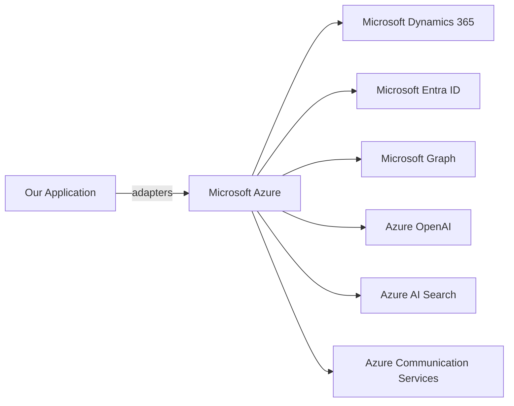

# Microsoft Ecosystem

## Azure as Primary Cloud

Azure is the required primary cloud platform because of integration with Microsoft Dynamics 365, Dataverse, Microsoft Graph, Microsoft Entra ID, and Azure OpenAI.

## Evaluation of Alternatives

| Criterion | Microsoft Azure | Amazon Web Services | Google Cloud Platform |
|---|---|---|---|
| Dynamics 365 integration | Native | Requires integration platform / custom | Requires integration platform / custom |
| Microsoft Graph / Entra ID | Native | Via federation / OIDC | Via federation / OIDC |
| Azure OpenAI | Native | Not available | Not available |
| Enterprise identity | Entra ID | Cognito / IAM | Identity Platform |
| Managed databases | Azure PostgreSQL, SQL | RDS | Cloud SQL / AlloyDB |
| Event infrastructure | Service Bus, Event Grid | MSK/SQS/SNS | Pub/Sub |
| Workflow | Durable Functions, Logic Apps | Step Functions | Workflows |
| AI/ML services | Azure OpenAI, AI Search, Cognitive Services | Bedrock, SageMaker | Vertex AI |
| GCC/Saudi availability | Available in many regions | Available | Available |
| Cost complexity | Moderate | Moderate | Moderate |
| Operational maturity | High | High | High |

### Azure Recommendation

Azure is the required primary cloud. AWS and GCP can host the system technically but would increase operational complexity, identity integration friction, and Dynamics 365 integration cost.

## Migration Implications

| Target | Implication |
|---|---|
| AWS | Re-implement identity federation, use AWS services for compute/storage, maintain Dynamics integration separately |
| GCP | Similar to AWS; requires Entra federation and custom Dynamics connectors |

## Vendor Lock-in Mitigation

- Use adapters/gateways for Dynamics 365, LLM, email, calendar, storage.
- Use Terraform/Bicep portability where practical.
- Avoid Azure-only APIs in domain logic.
- Containerize workloads for portability.

## Microsoft Ecosystem Diagram

