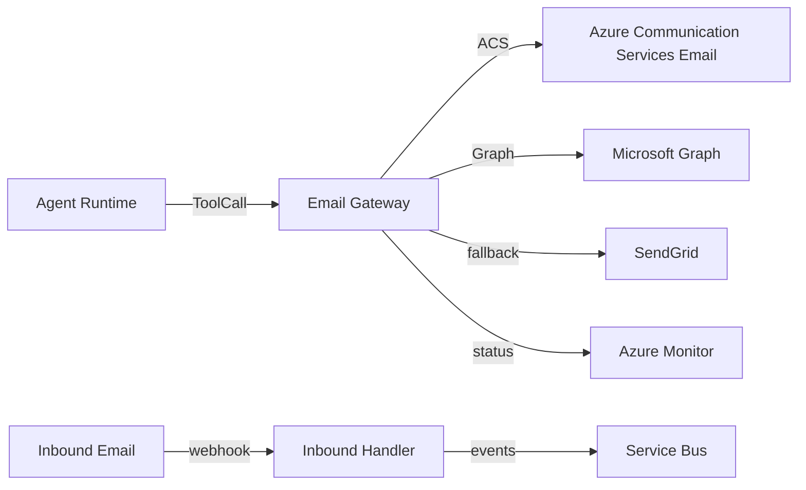

# Email Infrastructure

## Selection: Azure Communication Services Email (primary) with Microsoft Graph and SendGrid adapters

### Evaluation Matrix

| Criterion | Azure Communication Services Email | Microsoft Graph sendMail | SendGrid | Mailgun |
|---|---|---|---|---|
| Azure integration | Excellent | Excellent | Moderate | Moderate |
| Transactional email | Excellent | Good | Excellent | Excellent |
| Send-as-user | No | Yes | No | No |
| Bounce/Delivery tracking | Yes | Yes | Yes | Yes |
| Suppression list | Yes | No | Yes | Yes |
| Cost | Moderate | Free-ish (Graph limits) | Moderate | Moderate |
| Enterprise trust | High | High | Medium | Medium |

### Recommendation

**Azure Communication Services Email** as the primary transactional email provider. **Microsoft Graph** for send-as-user scenarios (sending from a user's mailbox). **SendGrid** as a fallback adapter.

## Email Use Cases

| Use Case | Provider |
|---|---|
| Bulk outbound sequences | Azure Communication Services |
| Personalized 1:1 from rep mailbox | Microsoft Graph |
| High-volume fallback | SendGrid |
| Inbound email parsing | Microsoft Graph subscriptions / webhooks |

## Architecture

- Email Gateway abstraction in Tool Gateway.
- Provider adapters: ACS Email, Graph, SendGrid.
- Templates stored in domain (not provider).
- Suppression and opt-out enforced before send.
- Bounce/complaint webhooks update lead/contact status.

## Threading

- Thread ID and Message-ID tracked per conversation.
- Replies matched by In-Reply-To and References headers.
- Microsoft Graph subscriptions for real-time inbound email.

## Suppression and Unsubscribe

- Global suppression list per tenant.
- One-click unsubscribe links.
- Opt-out honored immediately and propagated to CRM.
- Compliance with CAN-SPAM/GDPR.

## Rate Limits

- Per provider.
- Per tenant daily/hourly limits.
- Adaptive throttling based on bounce/complaint rates.

## Security

- SPF, DKIM, DMARC configured.
- Dedicated sending domains per tenant or shared pool.
- No PII in logs.
- OAuth for Microsoft Graph.

## Email Architecture Diagram

