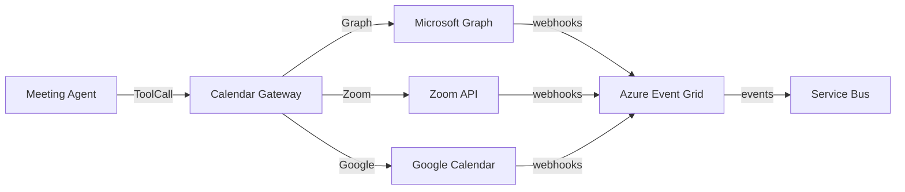

# Calendar and Meetings

## Selection: Microsoft Graph (primary) + Zoom/Google adapters

### Evaluation Matrix

| Criterion | Microsoft Graph | Google Calendar API | Zoom |
|---|---|---|---|
| Enterprise integration | Excellent | Moderate | Moderate |
| Calendar availability | Yes | Yes | Limited |
| Meeting creation | Yes (Teams/Outlook) | Yes (Google Meet) | Yes (Zoom) |
| Free/busy queries | Yes | Yes | No |
| Tenant context | Entra integrated | Google Workspace | Account-level |
| Webhooks | Yes | Yes | Yes |

### Recommendation

**Microsoft Graph** is the primary calendar and meeting provider for Outlook/Teams scheduling. Provide adapters for **Zoom** and **Google Meet** based on customer preference.

## Integration Patterns

| Operation | Provider |
|---|---|
| Query availability | Microsoft Graph / Google Calendar |
| Book Outlook/Teams meeting | Microsoft Graph |
| Book Zoom meeting | Zoom API |
| Book Google Meet | Google Calendar API |
| Reschedule/cancel | Respective provider |
| Receive attendee response | Provider webhooks |

## Provider Abstraction

- Calendar Gateway in Tool Gateway.
- Adapters for Microsoft Graph, Google, Zoom.
- Domain uses `Meeting` aggregate; provider IDs stored in `CalendarReference` value object.
- Time zone handling in adapter.

## Time Zones

- Store all times in UTC.
- Convert to attendee time zones for display.
- Detect daylight saving changes.

## Conflict Handling

- Query free/busy before booking.
- Handle conflicts via re-planning or human approval.
- Update mission state on conflict.

## Webhooks

- Microsoft Graph change notifications to Azure Event Grid.
- Zoom webhooks validated by signature.
- Google push notifications.

## Calendar/Meeting Architecture Diagram

