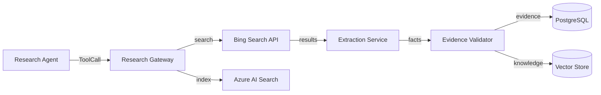

# Research Architecture

## Selection: Bing Search API + Azure AI Search + custom extraction/validation

### Evaluation Matrix

| Criterion | Bing Search API | Google Custom Search | DuckDuckGo / Brave | Perplexity |
|---|---|---|---|---|
| Commercial use | Yes | Paid | Varies | API |
| Result quality | Good | Good | Moderate | Summarized |
| Cost | Moderate | Moderate | Low/Variable | Higher |
| Rate limits | Good | Good | Lower | Moderate |
| Microsoft ecosystem | Good | None | None | None |

### Recommendation

**Bing Search API** for web search. **Azure AI Search** for internal knowledge and hybrid retrieval. Custom extraction, cross-checking, and validation prevent arbitrary web content from becoming trusted knowledge.

## Components

| Component | Technology |
|---|---|
| Web search | Bing Search API |
| Web extraction | Custom extraction service + readability libraries |
| Source validation | Domain allowlists, reliability scoring |
| Knowledge index | Azure AI Search / pgvector |
| Evidence store | PostgreSQL |
| Research cache | Redis |

## Provider Abstraction

- Research Gateway in Tool Gateway.
- Adapters for Bing Search, Azure AI Search, future providers.
- Domain receives `ResearchResult` with evidence metadata.

## Extraction Pipeline

1. Search query built by Research Agent.
2. Search adapter returns results.
3. Extraction service fetches pages (sandboxed).
4. Content parsed and sanitized.
5. Facts extracted with source and confidence.
6. Cross-checked against existing knowledge.
7. Validated by evidence validator.
8. Stored as evidence.

## Anti-Prompt-Injection

- Web content sanitized before inclusion in prompts.
- Extracted facts separated from raw HTML.
- No arbitrary web content passed to LLM.
- Output validation on all generated claims.

## Research Architecture Diagram

