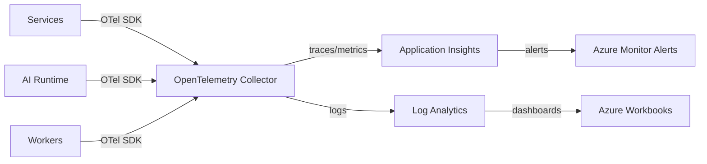

# Observability

## Selection: OpenTelemetry + Azure Monitor Application Insights + Log Analytics

### Evaluation Matrix

| Criterion | OpenTelemetry + Azure Monitor | Prometheus/Grafana | Datadog | New Relic |
|---|---|---|---|---|
| Azure integration | Excellent | Requires agents | Good | Good |
| Vendor neutrality | Excellent | Good | Low | Low |
| Traces/metrics/logs | Yes | Logs via Loki | Yes | Yes |
| AI telemetry | Custom via OTel | Custom | Custom | Custom |
| Cost | Azure consumption | Infrastructure + license | License | License |
| Multi-cloud future | Easy | Easy | N/A | N/A |

### Recommendation

**OpenTelemetry** for instrumentation with **Azure Monitor Application Insights** as the backend. Logs go to **Azure Monitor Logs / Log Analytics**. Dashboards in Azure Workbooks or Grafana.

## Observability Pillars

| Pillar | Technology | Notes |
|---|---|---|
| Traces | OpenTelemetry + Application Insights | Distributed correlation |
| Metrics | OpenTelemetry + Azure Monitor Metrics | Tenant-scoped dimensions |
| Logs | OpenTelemetry + Log Analytics | Structured, tenant-scoped |
| AI telemetry | Custom telemetry via OTel | Tokens, latency, cost |
| Alerts | Azure Monitor Alerts | Threshold and anomaly alerts |
| Dashboards | Azure Workbooks / Grafana | SRE dashboards |

## Standard Telemetry Schema

- `service.name`, `service.namespace`
- `tenantId`, `missionId`, `agentId`, `executionId`
- `correlationId`
- `model`, `modelProvider`, `promptVersion`
- `toolId`, `provider`
- `tokenInput`, `tokenOutput`, `costUsd`

## AI-Specific Telemetry

- Model used per execution.
- Prompt/policy/agent version.
- Token usage and cost.
- Reasoning/decision events.
- Tool call success/failure.
- Policy evaluation results.
- Human intervention events.

## Audit Integration

- Audit events also forwarded to Audit Service (immutable store).
- Observability logs are operational, not authoritative audit.

## Sampling

- 100% sampling for critical paths.
- Tail-based sampling for high-latency/errors.
- Cost-sensitive sampling for high-volume traces.

## Observability Architecture Diagram

## Proposed ADR

See `TAD-014 OpenTelemetry + Azure Monitor for Observability`.
