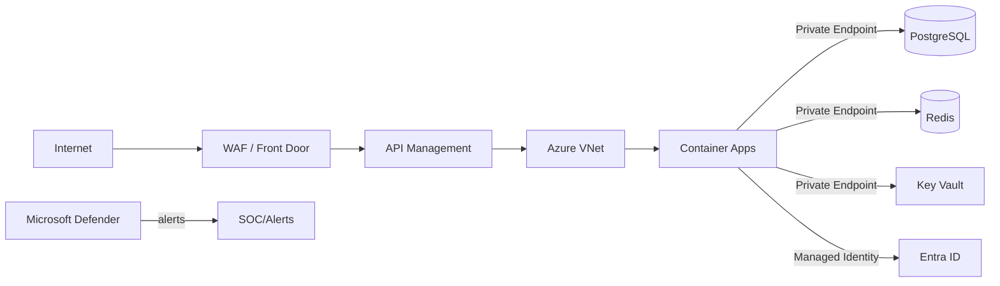

# Security Architecture

## Overview

Defense-in-depth across identity, network, application, data, and AI layers.

## Layers

| Layer | Controls |
|---|---|
| Network | Azure VNet, Private Endpoints, NSGs, WAF, DDoS |
| Identity | Entra ID, Managed Identities, RBAC/ABAC |
| Application | Input validation, authN/authZ, tenant isolation |
| Data | Encryption at rest/transit, RLS, key vault, backups |
| API | API Management, rate limiting, WAF, token validation |
| AI | Prompt injection defense, tool isolation, output validation |
| Operations | Secrets management, audit, monitoring, patching |

## Network Security

- All Azure PaaS services use Private Endpoints.
- No public IPs for databases or caches.
- Application Gateway / Azure Front Door with WAF for public ingress.
- NSGs restrict subnet traffic.
- DDoS Protection Standard.

## Encryption

- TLS 1.3 for data in transit.
- SSE for storage and databases.
- CMK via Key Vault for sensitive data.
- Application-level encryption for highly sensitive fields if required.

## API Security

- OAuth2/OIDC via Entra ID.
- API Management validates tokens, rate limits, policies.
- Webhook signature verification.
- Input schema validation.
- Output encoding.

## Webhook Security

- HMAC signature validation per provider.
- IP allowlists where possible.
- Replay attack prevention via idempotency keys.
- TLS required.

## Vulnerability Management

- Dependency scanning in CI/CD.
- Container image scanning.
- Secret scanning in repositories.
- Regular penetration testing.
- Security monitoring with Microsoft Defender for Cloud.

## Incident Response

- Automated alerts.
- Kill switch / emergency stop.
- Audit trail for forensic analysis.
- Runbooks for common incidents.

## Security Architecture Diagram

