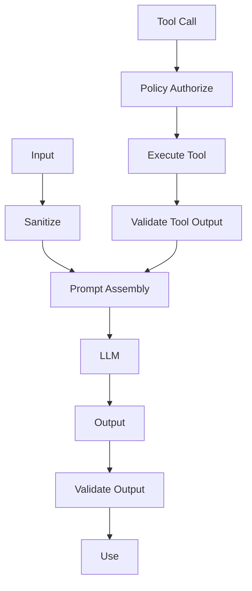

# AI Security

## Threat Model and Controls

| Threat | Controls |
|---|---|
| Prompt injection | Input validation, delimiters, system prompt hardening, output parsing, least privilege |
| Indirect prompt injection | Sanitize retrieved content, source allowlists, content isolation, output validation |
| Tool injection | Tool allowlist, schema validation, policy enforcement, no dynamic tool definitions |
| Memory poisoning | Memory write validation, anomaly detection, versioning, human correction |
| Knowledge poisoning | Source validation, provenance, confidence, human curation |
| Data exfiltration | No raw memory in outputs, PII redaction, output filters, tenant isolation |
| Cross-tenant leakage | Per-tenant context, RLS, per-tenant retrieval, separate vector filters |
| Privilege escalation | Capability registry, policy engine, no self-elevation, audit |
| Unsafe autonomous actions | Action risk engine, policy, approvals, emergency stop |
| Social engineering | Human escalation, policy, output validation, conversation limits |
| Malicious tool results | Tool output validation, sandboxing, schema checks, source attribution |

## Input Defenses

- Treat all user/external input as untrusted.
- Delimit tool outputs from instructions.
- Reject malformed structured outputs.
- Do not expose system prompts.
- Detect known injection patterns.

## Tool Use Defenses

- Strict allowlist of tools.
- Input schema validation.
- Policy evaluation before execution.
- Output validation after execution.
- No tool can access cross-tenant resources.

## Memory and Knowledge Defenses

- Write validation with evidence/confidence checks.
- Anomaly detection on updates.
- Tenant-scoped retrieval.
- Versioned updates and correction path.

## Output Defenses

- Structured output schema validation (Zod / JSON Schema).
- Claim verification and citation requirements.
- PII detection/redaction.
- No credential or secret disclosure.
- Content policy filters.

## Cross-Tenant Defenses

- Tenant ID in every context assembly step.
- Per-tenant vector filters or collections.
- Database RLS.
- Tenant-scoped cache keys.
- Tenant prefix in object storage.
- Separate prompts per tenant (no shared system prompt with tenant data).

## Red Teaming and Testing

- Prompt injection test suites.
- Tool abuse test cases.
- Cross-tenant leakage tests.
- Data exfiltration tests.
- Output validation tests.
- Regular AI security reviews.

## AI Security Diagram

